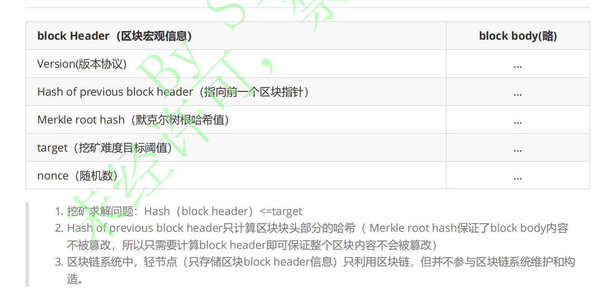
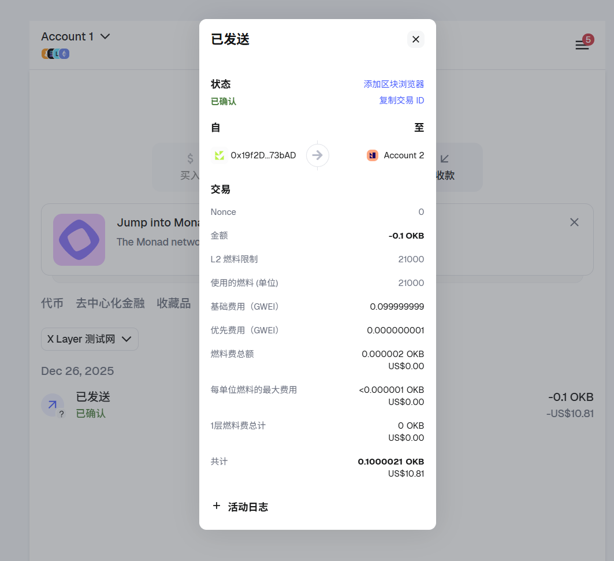
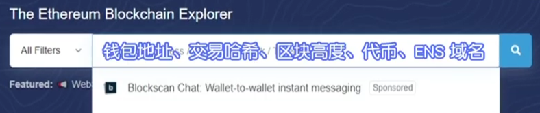
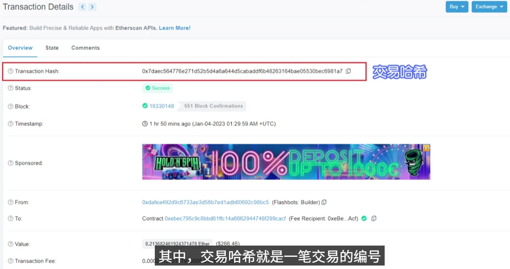
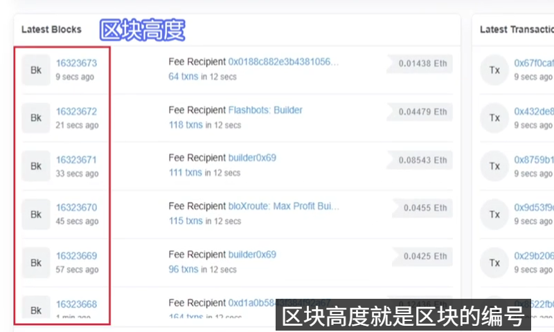

# 一、扫盲重点内容

## 1、区块链技术概览（了解）

所谓区块链，就是从原始的中心化交易系统---->去中心化系统

2008年11月中本聪发明比特币，开启了区块链的道路，比特币白皮书

去中心化的电子交易系统：比如A、B、C、D进行交易，相互之间进行支付

- A----->B 10个bitcoin，同时将这个账单告诉其余3人，大家都记账
- B----->C 5个bitcoin，，同时将这个账单告诉其余3人，大家都记账
- 。。。

这样一来，就一个账本，节点中的所有人将这个账本打包，打包成一个区块，这个区块的大小是1MB，可以存4000条交易记录。

这个块打包完成后，再接入到之前的交易块的后面，以此不断接入，形成一条链，我们就叫区块链

## 2、密码学原理

### 2.1 hash

sealed envelope（密封的信封）

puzzle friendly（谜题友好）：

"puzzle friendly" 在密码学和区块链领域通常指某种特性或算法设计对解谜过程友好，即易于验证但难以逆向推导。以下是几种译法及说明：

proof of work（工作量证明）

挖矿很难，验证很容易，difficult to solve，bug easy to verify。你一旦挖到了矿，这就是你的工作量的证明了。说了你做了大量的工作去计算

bit中的hash函数是sha256，secure hash algorithm

### 2.2 签名

中心化系统的账户管理：带上身份证去银行开户

区块链中，去中心化，每个用户自己决定是否开户，每个用户在本地创建一个公私钥对，就带表一个账户

 

公私钥对，来源于非对称加密算法

 

对称加密体系的弱点：

秘钥的分发不安全，不方便，在网络传输可能被窃听

非对称加密：加密用公钥，解密用私钥。

- 比如我要把一个信息传给你，我用你的公钥加密，然后你收到后，再用你的私钥解密，得到原来的信息
- 加密和解密都是用的接收方的
- 公钥不用保密，可以告诉所有人
- 私钥要保存在本地
- 传输双方都不需要知道对方的私钥，只需要公钥进行相互的加密即可

比特币的账户，就在本地产生一对公钥和私钥

- 公钥相当于银行账号，别人给你转账，只需要知道公钥
- 私钥相当于密码，知道了密码，就可以将钱转走

既然比特币系统是不加密的，信息都是公开的，那我要公钥和私钥干嘛？

- 用来做**签名**
- 比如我要转10个比特币给你，我把这个交易发布到区块链上，别人怎么知道这个交易是我发起的？
- 这就需要我在发布交易的时候，要用我这个私钥对这个交易签名
- 别人收到这个交易后，用公钥去验证这个签名的正确性。
- 这就确保这笔交易是某人发起的

既然每个人是独立的产生账户，万一两个人生成的公私钥对恰好相同，那不是可以用其中一个公钥去转走别人的钱了？

- 这个几率可以忽略不计。因为公私钥对是256位的哈希，相同的概率为1/(2^256)次方。这个显然是不现实的
- 但这个前提是生成公私钥和签名的时候一定要有好的随机源。
- 只要有一次签名的时候随机源选的不好，有可能出现两个人的公私钥对一样，这样就全完了

 of  randomness

比特币一般是先对一个message取hash，然后再对hash签名

### 2.3 总结

1. **哈希函数（SHA256）的特性**：哈希函数具备谜题友好的特点，即正向计算容易、逆向破解困难，这是工作量证明（挖矿）的核心 —— 挖矿求解哈希难题的过程很难，但验证结果是否有效却很简单。
2. **非对称加密的作用**：对比对称加密密钥分发不安全的弱点，非对称加密用公钥加密、私钥解密，无需传输私钥；区块链中用户本地生成的公私钥对就是账户，公钥相当于收款账号可公开，私钥相当于密码需妥善保管。
3. **数字签名的核心价值**：比特币系统信息公开，私钥的核心用途是给交易签名，其他人用对应的公钥验证签名，就能确认交易是账户所有者发起的，保证交易的真实性和不可否认性。
4. **公私钥对重复的概率极低**：256 位公私钥对重复的概率仅为 1/(2^256)，几乎不可

## 3、区块信息

完整区块包括块头和body，构成如下

 

区块块头信息如下

 

## 4、轻节点和全节点

 

## 5、pow、pos、dpos的区别及优缺点

**注意：DPOS有101个选举的超级节点**

 

## 6、加密钱包和网络的使用（掌握）

- 安装小狐狸钱包，并创建2个账号

  

- 连接到X Layer 水龙头测试网，尝试在2个账号间互转代币

 

## 7、简述POW挖矿的过程，怎么处理分叉的情况

- 挖矿
  - 挖矿是通过专用“矿机”计算生产虚拟货币的过程，其本质是计算机通过解决复杂数学问题来获取加密货币奖励。‌
  - 更精细的理解就是，区块尝试各种nonce随机值，使得产生的区块哈希值小于等于目标阈值0。
  - 只要有一台矿机计算的hash值满足要求，那么这个区块就会拥有铸币权，会产生一定数量比特币的奖励
- 如何处理分叉？
  - 所有矿工遵循最长链原则
  - 从各个矿工从分叉的位置分别往后挖，哪个分叉最先挖到下一个区块，会立即对所有节点进行广播，此时其他所有节点将会从最长的区块开始往后挖，之前分叉的短区块会被抛弃。

## 8、为什么说区块链是不可篡改的（密码学、共识）

- 一是密码学的保证：别人没有自己的私钥，就无法伪造其合法签名，从而无法将其账户上BTC转走（前提：系统中大多数算力掌握在好人手中）。
-  二是共识机制：保证了恶意交易不被系统承认。有几个重要特点：
  - **工作量证明（PoW）**：记账权取决于计算力投入，篡改历史需要超过全网51%的计算力，成本极高。
  - **最长链原则**：节点始终认可**累计工作量最大（最长/最难链）** 的链为主链，分歧时以此为准。
  - **去中心化信任**：不依赖任何中心机构，通过数学和博弈规则建立信任。

## 9、POW的难度调整机制

- 比特币系统中，要求10分钟出一个块。随着算力的增强，如果不进行难度调整，那么出块的速度会极大提高。为此要设立难度调整机制。
- 每2016个块，调整一次难度阈值。用出这2016块实际的时间/2016块的理论时间，对原始target做动态调整。
- 但是动态调整不会超过原始target的上下四倍
- 2016个块，10分钟一个块，总耗时就是2个星期

## 10、什么是双花，什么情况下会产生，如何预防

- 什么是双花
  - 双花是指同一数字资产被重复使用，即一笔钱同时转发给多个人。

### 1. 赛跑攻击 (Race Attack)

**场景**：攻击者在极短时间内发送两笔冲突交易，利用网络广播的时间差，试图让“发给商家”的交易先被看到（让商家以为付了钱），而让“发给自己”的交易先被打包进区块。

- **核心对策：增加确认数 (Block Confirmations)**
  - **原理**：这是最有效的预防手段。商家不应该在看到交易的一瞬间就提供服务（这叫“零确认交易”），而应该等待这笔交易被打包进一个区块，甚至等待后续产生更多的区块。
  - **动作**：在比特币中，通常建议等待 **1 个确认**（对小额交易）或 **6 个确认**（对大额交易）。因为一旦交易被写进区块，想通过“赛跑”来撤回它几乎是不可能的。

------

### 2. 芬尼攻击 (Finney Attack)

**场景**：这是一种**矿工参与**的攻击。矿工私下挖出一个包含“自己转给自己”交易的区块，先不广播；然后去商家那付钱买东西；等商家发货后，矿工立即广播之前私藏的区块。由于私藏区块更早产生，商家那笔交易会被全网判定为无效。

- **核心对策：禁止“零确认” + 节点实时监控**
  - **原理**：这种攻击完全依赖于商家“即时发货”。
  - **动作**：
    1. **绝不接受零确认**：只要商家坚持看到至少 1 个区块确认，芬尼攻击就会失效。
    2. **交易传播速度分析**：节点可以监控全网，如果发现某笔交易在主链之外突然出现了一个高度竞争的私有块，可以触发警报。

------

### 3. 51% 攻击 (The 51% Attack)

**场景**：攻击者掌握了全网超过 50% 的算力，他们可以凭借算力优势强行制造一条“更长的分叉链”，从而重写过去已经发生的账本（撤回已确认的交易）。

- **核心对策：经济博弈与共识升级**
  - **提高算力成本 (Hash Rate)**：通过吸引更多诚实矿工加入，让攻击成本（租用或购买硬件的费用）高到无法承受。对于比特币这种体量的网络，51% 攻击的成本是天文数字。
  - **共识机制转型 (PoS)**：像以太坊那样从 PoW（算力证明）转向 **PoS（权益证明）**。在 PoS 中，攻击者需要买下全网 51% 的代币，一旦作恶，其质押的代币会被**“罚没（Slashing）”**，这从经济上彻底封死了作恶动机。
  - **检查点 (Checkpoints)**：开发者在代码中硬编码一些“不可回滚”的区块高度，防止历史被大范围篡改。

### 4. 总结

**预防零确认风险（赛跑/芬尼攻击）**：核心在于**‘延迟确认’**。通过等待多个区块确认（如 6 个确认），利用概率学的原理让撤回交易的难度呈指数级增加。

**预防共识层风险（51%攻击）**：核心在于**‘经济博弈’**。在 PoW 下是拼算力成本，让作恶收益远低于挖矿收益；在 PoS 下是拼违约代价，通过 Slashing 机制让作恶者血本无归。

**底层数据校验**：所有节点在收到交易时都会根据 **UTXO 集合**进行即时校验，确保任何一笔被引用的资金在账本上都是‘未花费’状态。”

## 11、共识机制解决了什么问题？

- 想象一个去中心化的班级，没有班长，但大家要共同维护一份**唯一、不可篡改的班级日志**。
- **共识机制要解决的问题就是：谁来写今天的日志？凭什么选他？如果同时有几个人写，听谁的？**

# 二、加密钱包和网络的使用

# 三、区块浏览器

## 3.1 搜索框

以太坊的浏览器搜索框可以查询如下内容

 

## 3.2 交易hash

就是一笔交易的编号，当交易成功后，交易hash是唯一且不可篡改的

 

## 3.3 区块高度

就是链入的区块编号，以此递增

 

