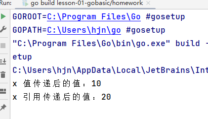
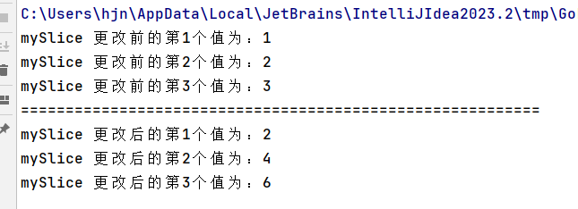
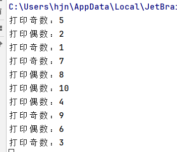
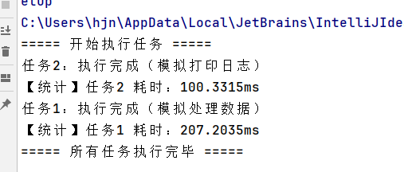
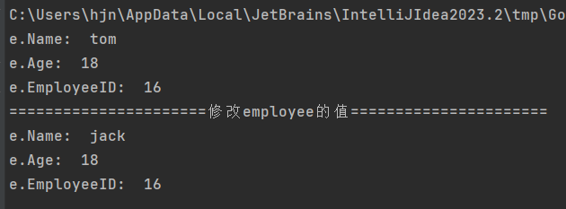
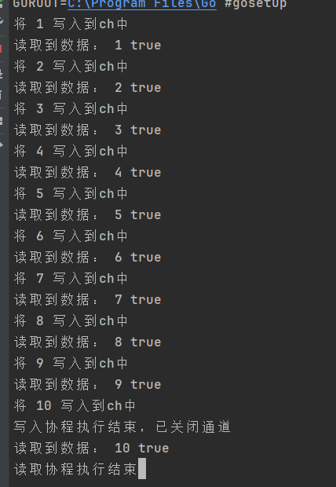
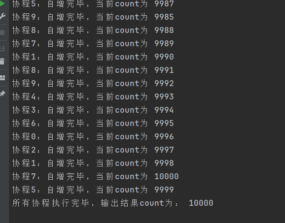
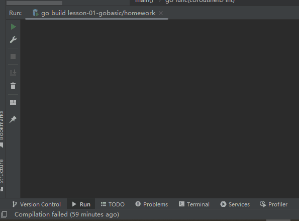
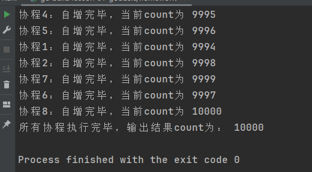

# 一、指针

## 题目1

编写一个Go程序，定义一个函数，该函数接收一个整数指针作为参数，在函数内部将该指针指向的值增加10，然后在主函数中调用该函数并输出修改后的值。

```go
func incrementByP(p *int) {
	*p = *p + 10
}

func incrementByValue(p int) {
	p = p + 10
}

func main() {
	x := 10
	incrementByValue(x)
	fmt.Printf("x 值传递后的值：%d\n", x)

	incrementByP(&x)
	fmt.Printf("x 引用传递后的值：%d\n", x)
}
```

运行结果

 


## 题目2

实现一个函数，接收一个整数切片的指针，将切片中的每个元素乘以2。

```go
func incrementByP(p *[]int) {
	for i := 0; i < len(*p); i++ {
		(*p)[i] *= 2
	}
}

func incrementByValue(p int) {
	p = p + 10
}

func main() {

	mySlice := make([]int, 3)
	mySlice[0] = 1
	mySlice[1] = 2
	mySlice[2] = 3

	for i := 0; i < len(mySlice); i++ {
		fmt.Printf("mySlice 更改前的第%d个值为：%d\n", i+1, mySlice[i])
	}
	// 执行更改
	incrementByP(&mySlice)
	fmt.Println("==========================================================")
	for i := 0; i < len(mySlice); i++ {
		fmt.Printf("mySlice 更改后的第%d个值为：%d\n", i+1, mySlice[i])
	}
}
```

运行结果

 


# 二、Goroutine

## 题目1

编写一个程序，使用 go 关键字启动两个协程，一个协程打印从1到10的奇数，另一个协程打印从2到10的偶数。
考察点 ： go 关键字的使用、协程的并发执行。

```go
// 打印偶数
func printEven() {
	i := 2
	var wg sync.WaitGroup
	for i <= 10 {
		wg.Add(1)
		go func(id int) {
			defer wg.Done()
			time.Sleep(1 * time.Second)
			if id%2 == 0 {
				fmt.Printf("打印偶数：%d\n", id)
			}
		}(i)
		i++
	}
}

// 打印奇数
func printOdd() {
	i := 0
	var wg sync.WaitGroup
	for i <= 10 {
		wg.Add(1)
		go func(id int) {
			defer wg.Done()
			time.Sleep(1 * time.Second)
			if id%2 != 0 {
				fmt.Printf("打印奇数：%d\n", id)
			}
		}(i)
		i++
	}
}

// 打印偶数
func printEven1() {
	go func() {
		i := 2
		for i <= 10 {
			if i%2 == 0 {
				fmt.Printf("打印偶数：%d\n", i)
			}
			i++
		}
	}()
}

// 打印奇数
func printOdd1() {
	go func() {
		i := 0
		for i <= 10 {
			if i%2 != 0 {
				fmt.Printf("打印奇数：%d\n", i)
			}
			i++
		}
	}()
}

func main() {
	//printEven()
	//printOdd()
	printEven()
	printOdd()

	time.Sleep(time.Minute)
}
```

运行效果：奇数偶数交替打印

 

## 题目2

设计一个任务调度器，接收一组任务（可以用函数表示），并使用协程并发执行这些任务，同时统计每个任务的执行时间。
考察点 ：协程原理、并发任务调度。

```go

func task1() {
	time.Sleep(200 * time.Millisecond) // 模拟任务执行耗时
	fmt.Println("任务1：执行完成（模拟处理数据）")
}

func task2() {
	time.Sleep(100 * time.Millisecond)
	fmt.Println("任务2：执行完成（模拟打印日志）")
}

func runTask(taskName string, task func(), wg *sync.WaitGroup) {
	defer wg.Done()
	start := time.Now()
	task()
	cost := time.Since(start)
	fmt.Printf("【统计】%s 耗时：%v\n", taskName, cost)
}

func main() {

	var wg sync.WaitGroup

	fmt.Println("===== 开始执行任务 =====")
	wg.Add(1)
	go runTask("任务1", task1, &wg)
	wg.Add(1)
	go runTask("任务2", task2, &wg)

	// 等待任务完成
	wg.Wait()
	fmt.Println("===== 所有任务执行完毕 =====")
}
```

运行效果

 


# 三、面向对象

## 题目1

定义一个 Shape 接口，包含 Area() 和 Perimeter() 两个方法。然后创建 Rectangle 和 Circle 结构体，实现 Shape 接口。在主函数中，创建这两个结构体的实例，并调用它们的 Area() 和 Perimeter() 方法。
考察点 ：接口的定义与实现、面向对象编程风格。

```go

type Shape interface {
	Area() float64 // 相当于java中的double
	Perimeter() float64
}

// 矩形类
type Rectangle struct {
	Width, Height float64
}

// 实现方法
func (r Rectangle) Area() float64 {
	return r.Width * r.Height
}
func (r Rectangle) Perimeter() float64 {
	return 2 * (r.Width + r.Height)
}

// 圆形
type Circle struct {
	Radius float64
}

func (c Circle) Area() float64 {
	return math.Pi * c.Radius * c.Radius
}
func (c Circle) Perimeter() float64 {
	return 2 * math.Pi * c.Radius
}

func main() {
	rectangle := Rectangle{Width: 3, Height: 5}
	circle := Circle{Radius: 5}
	shapes := []Shape{rectangle, circle}
	for idx, shape := range shapes {
		fmt.Println(idx, shape, "的面积是：", shape.Area())
	}
}
```

运行效果：

 

## 题目2

使用组合的方式创建一个 Person 结构体，包含 Name 和 Age 字段，再创建一个 Employee 结构体，组合 Person 结构体并添加 EmployeeID 字段。为 Employee 结构体实现一个 PrintInfo() 方法，输出员工的信息。
考察点 ：组合的使用、方法接收者。

```go
type Person struct {
	Name string
	Age  int
}

type Employee struct {
	Person     // 继承
	EmployeeID string
}

func (e Employee) PrintInfo() {
	fmt.Println("e.Name: ", e.Name)
	fmt.Println("e.Age: ", e.Age)
	fmt.Println("e.EmployeeID: ", e.EmployeeID)
}

func (e *Employee) setName(name string) {
	e.Name = name
}

func main() {
	person := Person{"tom", 18}
	employee := Employee{person, "16"}
	employee.PrintInfo()

	fmt.Println("======================修改employee的值======================")
	employee.setName("jack")
	employee.PrintInfo()
}
```

运行效果：

 


# 四、Channel

## 题目1

编写一个程序，使用通道实现两个协程之间的通信。一个协程生成从1到10的整数，并将这些整数发送到通道中，另一个协程从通道中接收这些整数并打印出来。
考察点 ：通道的基本使用、协程间通信。

```go
func chDemo() {
    // 新建一个channel，带buffer
    ch := make(chan int, 10)

    go func() {
       for i := 1; i <= 10; i++ {
          time.Sleep(time.Second)
          fmt.Println("将", i, "写入到ch中")
          ch <- i
       }
       close(ch) // 关键：写完所有数据后关闭通道
       fmt.Println("写入协程执行结束，已关闭通道")
    }()

    go func() {
       defer fmt.Printf("读取协程执行结束")
       for {
          time.Sleep(time.Second)
          value, ok := <-ch
          if !ok {
             break
          }
          fmt.Println("读取到数据：", value, ok)
       }
    }()
}
```

运行效果

 


## 题目2

实现一个带有缓冲的通道，生产者协程向通道中发送100个整数，消费者协程从通道中接收这些整数并打印。
考察点 ：通道的缓冲机制。

```go
func chDemo1() {
    // 新建一个channel，带buffer
    ch := make(chan int, 100)

    go func() {
       for i := 1; i <= 100; i++ {
          time.Sleep(50 * time.Millisecond)
          fmt.Println("将", i, "写入到ch中")
          ch <- i
       }
       close(ch) // 关键：写完所有数据后关闭通道
       fmt.Println("写入协程执行结束，已关闭通道")
    }()

    go func() {
       defer fmt.Printf("读取协程执行结束")
       for {
          time.Sleep(100 * time.Millisecond)
          value, ok := <-ch
          if !ok {
             break
          }
          fmt.Println("读取到数据：", value, ok)
       }
    }()
}
```

运行效果

```go
将 1 写入到ch中
读取到数据： 1 true
将 2 写入到ch中
将 3 写入到ch中
读取到数据： 2 true
将 4 写入到ch中
将 5 写入到ch中
读取到数据： 3 true
将 6 写入到ch中
读取到数据： 4 true
将 7 写入到ch中
将 8 写入到ch中
读取到数据： 5 true
将 9 写入到ch中
将 10 写入到ch中
读取到数据： 6 true
将 11 写入到ch中
将 12 写入到ch中
读取到数据： 7 true
将 13 写入到ch中
读取到数据： 8 true
将 14 写入到ch中
将 15 写入到ch中
读取到数据： 9 true
将 16 写入到ch中
将 17 写入到ch中
读取到数据： 10 true
将 18 写入到ch中
将 19 写入到ch中
读取到数据： 11 true
将 20 写入到ch中
将 21 写入到ch中
读取到数据： 12 true
将 22 写入到ch中
读取到数据： 13 true
将 23 写入到ch中
将 24 写入到ch中
读取到数据： 14 true
将 25 写入到ch中
将 26 写入到ch中
读取到数据： 15 true
将 27 写入到ch中
读取到数据： 16 true
将 28 写入到ch中
将 29 写入到ch中
读取到数据： 17 true
将 30 写入到ch中
将 31 写入到ch中
读取到数据： 18 true
将 32 写入到ch中
将 33 写入到ch中
读取到数据： 19 true
将 34 写入到ch中
读取到数据： 20 true
将 35 写入到ch中
将 36 写入到ch中
读取到数据： 21 true
将 37 写入到ch中
将 38 写入到ch中
读取到数据： 22 true
将 39 写入到ch中
将 40 写入到ch中
读取到数据： 23 true
将 41 写入到ch中
读取到数据： 24 true
将 42 写入到ch中
将 43 写入到ch中
读取到数据： 25 true
将 44 写入到ch中
将 45 写入到ch中
读取到数据： 26 true
将 46 写入到ch中
将 47 写入到ch中
读取到数据： 27 true
将 48 写入到ch中
读取到数据： 28 true
将 49 写入到ch中
将 50 写入到ch中
读取到数据： 29 true
将 51 写入到ch中
将 52 写入到ch中
读取到数据： 30 true
将 53 写入到ch中
将 54 写入到ch中
读取到数据： 31 true
将 55 写入到ch中
将 56 写入到ch中
读取到数据： 32 true
将 57 写入到ch中
读取到数据： 33 true
将 58 写入到ch中
将 59 写入到ch中
读取到数据： 34 true
将 60 写入到ch中
将 61 写入到ch中
读取到数据： 35 true
将 62 写入到ch中
读取到数据： 36 true
将 63 写入到ch中
将 64 写入到ch中
读取到数据： 37 true
将 65 写入到ch中
将 66 写入到ch中
读取到数据： 38 true
将 67 写入到ch中
将 68 写入到ch中
读取到数据： 39 true
将 69 写入到ch中
读取到数据： 40 true
将 70 写入到ch中
将 71 写入到ch中
读取到数据： 41 true
将 72 写入到ch中
将 73 写入到ch中
读取到数据： 42 true
将 74 写入到ch中
将 75 写入到ch中
读取到数据： 43 true
将 76 写入到ch中
读取到数据： 44 true
将 77 写入到ch中
将 78 写入到ch中
读取到数据： 45 true
将 79 写入到ch中
将 80 写入到ch中
读取到数据： 46 true
将 81 写入到ch中
将 82 写入到ch中
读取到数据： 47 true
将 83 写入到ch中
将 84 写入到ch中
读取到数据： 48 true
将 85 写入到ch中
读取到数据： 49 true
将 86 写入到ch中
将 87 写入到ch中
读取到数据： 50 true
将 88 写入到ch中
将 89 写入到ch中
读取到数据： 51 true
将 90 写入到ch中
读取到数据： 52 true
将 91 写入到ch中
将 92 写入到ch中
读取到数据： 53 true
将 93 写入到ch中
将 94 写入到ch中
读取到数据： 54 true
将 95 写入到ch中
将 96 写入到ch中
读取到数据： 55 true
将 97 写入到ch中
读取到数据： 56 true
将 98 写入到ch中
将 99 写入到ch中
读取到数据： 57 true
将 100 写入到ch中
写入协程执行结束，已关闭通道
读取到数据： 58 true
读取到数据： 59 true
读取到数据： 60 true
读取到数据： 61 true
读取到数据： 62 true
读取到数据： 63 true
读取到数据： 64 true
读取到数据： 65 true
读取到数据： 66 true
读取到数据： 67 true
读取到数据： 68 true
读取到数据： 69 true
读取到数据： 70 true
读取到数据： 71 true
读取到数据： 72 true
读取到数据： 73 true
读取到数据： 74 true
读取到数据： 75 true
读取到数据： 76 true
读取到数据： 77 true
读取到数据： 78 true
读取到数据： 79 true
读取到数据： 80 true
读取到数据： 81 true
读取到数据： 82 true
读取到数据： 83 true
读取到数据： 84 true
读取到数据： 85 true
读取到数据： 86 true
读取到数据： 87 true
读取到数据： 88 true
读取到数据： 89 true
读取到数据： 90 true
读取到数据： 91 true
读取到数据： 92 true
读取到数据： 93 true
读取到数据： 94 true
读取到数据： 95 true
读取到数据： 96 true
读取到数据： 97 true
读取到数据： 98 true
读取到数据： 99 true
读取到数据： 100 true
读取协程执行结束

```


# 五、锁机制

## 题目1

编写一个程序，使用 sync.Mutex 来保护一个共享的计数器。启动10个协程，每个协程对计数器进行1000次递增操作，最后输出计数器的值。
考察点 ： sync.Mutex 的使用、并发数据安全。

```go
package main

import (
	"fmt"
	"sync"
	"time"
)

type SafeCalculator struct {
	mu    sync.Mutex
	count int32
}

// 自增的方法，确保安全
func (c *SafeCalculator) increment() {
	c.mu.Lock()
	defer c.mu.Unlock()
	c.count++
}

// 获取count
func (c *SafeCalculator) getCount() int32 {
	return c.count
}

func main() {
	lock := sync.Mutex{}
	calculator := SafeCalculator{lock, 0}

	// 使用 waitGroup 计数等待
	wg := sync.WaitGroup{}
	for i := 0; i < 10; i++ {
		wg.Add(1)
		go func(coroutineID int) {
			defer wg.Done()
			j := 0
			for j < 1000 {
				time.Sleep(10 * time.Millisecond)
				calculator.increment()
				fmt.Printf("协程%d：自增完毕，当前count为 %d\n", coroutineID, calculator.getCount())
				j++
			}
		}(i)
	}

	// 等待所有协程执行完毕，输出结果
	wg.Wait()
	fmt.Println("所有协程执行完毕，输出结果count为：", calculator.getCount())
}

```

运行效果：

 


## 题目2

使用原子操作（ sync/atomic 包）实现一个无锁的计数器。启动10个协程，每个协程对计数器进行1000次递增操作，最后输出计数器的值。
考察点 ：原子操作、并发数据安全。

```go

// 原子自增，移除Mutex
type SafeCalculator struct {
	count int32
}

func (c *SafeCalculator) increment() {
	atomic.AddInt32(&c.count, 1)
}

// 获取count
func (c *SafeCalculator) getCount() int32 {
	return c.count
}

func main() {
	calculator := SafeCalculator{0}

	// 使用 waitGroup 计数等待
	wg := sync.WaitGroup{}
	for i := 0; i < 10; i++ {
		wg.Add(1)
		go func(coroutineID int) {
			defer wg.Done()
			j := 0
			for j < 1000 {
				time.Sleep(5 * time.Millisecond)
				calculator.increment()
				fmt.Printf("协程%d：自增完毕，当前count为 %d\n", coroutineID, calculator.getCount())
				j++
			}
		}(i)
	}

	// 等待所有协程执行完毕，输出结果
	wg.Wait()
	fmt.Println("所有协程执行完毕，输出结果count为：", calculator.getCount())
}

```

运行效果：

 

 


