# 一、进阶gorm

## 题目1：模型定义

- 假设你要开发一个博客系统，有以下几个实体： User （用户）、 Post （文章）、 Comment （评论）。
  - 要求 ：
    - 使用Gorm定义 User 、 Post 和 Comment 模型，其中 User 与 Post 是一对多关系（一个用户可以发布多篇文章）， Post 与 Comment 也是一对多关系（一篇文章可以有多个评论）。
    - 编写Go代码，使用Gorm创建这些模型对应的数据库表。

```go
package main

import (
	"fmt"
	"gorm.io/driver/mysql"
	"gorm.io/gorm"
	"gorm.io/gorm/logger"
	"log"
	"os"
	"time"
)

// 1.定义模型结构 + 关联关系
// User 用户
type User struct {
	gorm.Model        // 具有默认字段：ID，CreateAt，UpdatedAt, DeletedAt
	UserName   string `gorm:"type:varchar(50);not null;unique;comment:用户名"`
	Password   string `gorm:"type:varchar(100);not null;unique;comment:密码"`
	Email      string `gorm:"type:varchar(100);unique;comment:电子邮箱"`
}

// Post 文章类
type Post struct {
	gorm.Model        // 具有默认字段：ID，CreateAt，UpdatedAt, DeletedAt
	Title      string `gorm:"type:varchar(200);not null;comment:文章标题"`
	Content    string `gorm:"type:text;not null;comment:文章内容"`
	UserID     string `gorm:"not null;comment:所属用户ID"`
}

// Comment 评论类
type Comment struct {
	gorm.Model        // 嵌入默认字段
	Content    string `gorm:"type:text;not null;comment:评论内容"`
	PostID     uint   `gorm:"not null;comment:所属文章ID"` // 外键：关联Post的ID
	UserID     uint   `gorm:"not null;comment:评论用户ID"` // 扩展：评论所属用户（可选）
}

func main() {
	// 2. 配置DSN（适配你之前的MySQL环境：端口3307，库名go-study）
	dsn := "root:x3237219@tcp(192.168.0.58:3306)/go-study?charset=utf8mb4&parseTime=True&loc=Local"

	// 3. 配置Gorm日志（方便查看SQL执行过程）
	newLogger := logger.New(
		log.New(os.Stdout, "\r\n", log.LstdFlags), // 输出到控制台
		logger.Config{
			SlowThreshold: time.Second, // 慢SQL阈值
			LogLevel:      logger.Info, // 日志级别：Info显示执行的SQL
			Colorful:      true,        // 彩色输出
		},
	)

	// 4. 连接MySQL数据库
	db, err := gorm.Open(mysql.Open(dsn), &gorm.Config{
		Logger: newLogger, // 启用日志
	})
	if err != nil {
		fmt.Printf("数据库连接失败：%v\n", err)
		return
	}
	fmt.Println("db", db)

	// 5. 自动迁移（创建表 + 维护字段/索引/外键）
	err = db.AutoMigrate(&User{}, &Post{}, &Comment{})
	if err != nil {
		log.Fatalf("创建表失败：%v", err)
	}
	log.Println("表创建/更新成功！")
}

```

运行效果如下：

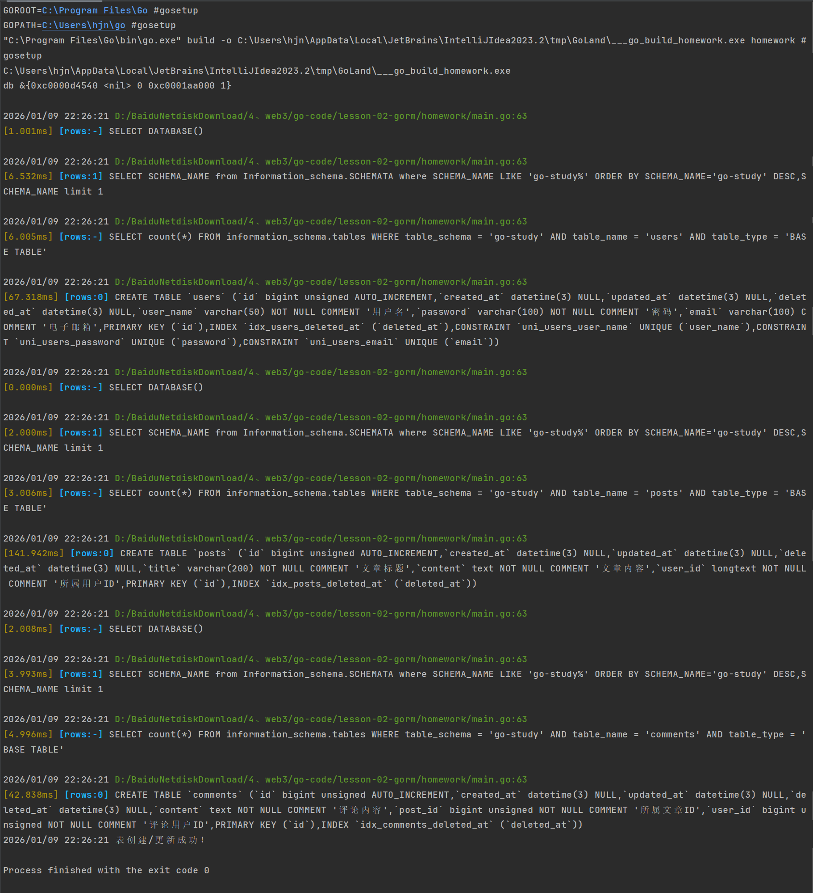 

表创建成功并导入测试数据

 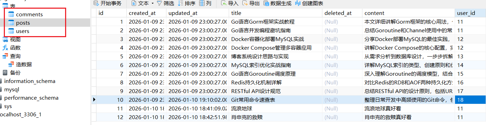 


## 题目2：关联查询

- 基于上述博客系统的模型定义。
  - 要求 ：
    - 编写Go代码，使用Gorm查询某个用户发布的所有文章及其对应的评论信息。
    
    - 编写Go代码，使用Gorm查询评论数量最多的文章信息。


### 1. 编写Go代码，使用Gorm查询某个用户发布的所有文章及其对应的评论信息。

```go
// 功能1：查询指定用户的所有文章及对应的评论
// 新增容错：查询不到数据时返回空列表，不报错
func queryUserPostsWithComments(userID uint) ([]PostWithComments, error) {
	var posts []Post
	// Preload("Comments") 预加载评论，避免N+1查询  其实就是用了in的方式  ，执行 SELECT * FROM comments WHERE post_id IN (1,2,3)；
	err := db.Where("user_id = ?", userID).Find(&posts).Error
	if err != nil {
		return nil, fmt.Errorf("查询文章失败：%v", err)
	}

	if err != nil {
		return nil, fmt.Errorf("查询用户文章失败：%v", err)
	}

	// 友好提示：无数据时告知
	if len(posts) == 0 {
		log.Printf("用户ID=%d 暂无发布的文章", userID)
		return nil, nil
	}

	// 提取文章id，去查评论
	var postIDs []uint

	// 文章封装成map key为id，value是文章
	var postMap = make(map[uint]Post)
	for _, post := range posts {
		postIDs = append(postIDs, post.ID)
		postMap[post.ID] = post
	}

	var comments []Comment
	err = db.Where("post_id IN (?)", postIDs).Find(&comments).Error
	if err != nil {
		return nil, fmt.Errorf("查询评论失败：%v", err)
	}

	// 遍历评论，封装成 postID -》 comments切片的形式  即一篇文章对应多个评论对象
	var postIdWithCommentsMap = make(map[uint][]Comment)
	for _, comment := range comments {
		innerComments := postIdWithCommentsMap[comment.PostID]
		if innerComments != nil {
			innerComments = append(innerComments, comment)
			postIdWithCommentsMap[comment.PostID] = innerComments
			continue
		}
		tempComment := make([]Comment, 0)
		tempComment = append(tempComment, comment)
		postIdWithCommentsMap[comment.PostID] = tempComment
	}

	// 封装文章和评论信息 一篇文章对应多个评论的切片 遍历文章id 来封装
	var postWithComments []PostWithComments
	for postId, commentVal := range postIdWithCommentsMap {
		postWithComments = append(postWithComments, PostWithComments{
			postMap[postId],
			commentVal,
		})
	}

	return postWithComments, nil
}

func main() {
	initDB()
	postWithComments, err := queryUserPostsWithComments(11)

	if err != nil { // 必须先处理错误！
		log.Fatal(err)
	}

	for i := 0; i < len(postWithComments); i++ {
		postWithComment := postWithComments[i] // 通过下标获取当前文章
		// 格式化JSON输出
		jsonData, _ := json.MarshalIndent(postWithComment, "", "  ")
		fmt.Printf("第%d篇文章及其评论：%s\n", i+1, string(jsonData))
	}
```

运行效果如下，获取到了11号用户的所有文章，以及文章的评论

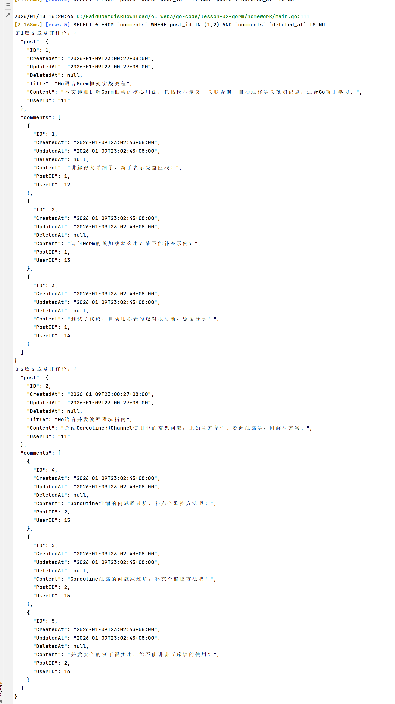 


### 2. 编写Go代码，使用Gorm查询评论数量最多的文章信息。

```go
func main() {
	initDB()
	post, count, err := queryMaxCommentPost()
	if err != nil {
		_ = fmt.Errorf("查询评论最多的文章失败：%v")
	}

	// 格式化JSON输出
	jsonData, _ := json.MarshalIndent(post, "", "  ")
	fmt.Printf("评论最多的文章信息：%s\n", string(jsonData))
	fmt.Printf("评论数量是：%d\n", count)
}

// 功能2：使用Gorm查询评论数量最多的文章信息。
func queryMaxCommentPost() (Post, int, error) {

	// 第一步 统计评论数量（和你的sql逻辑一致）
	var countResult PostCommentCount
	err := db.Model(&Comment{}).
		Select("post_id AS postId, COUNT(1) AS count").
		Where("deleted_at IS NULL").
		Group("post_id").
		Order("count desc").
		Limit(1).
		Scan(&countResult).Error

	if err != nil {
		return Post{}, 0, fmt.Errorf("统计评论失败数量：%v", err)
	}

	if countResult.PostId == 0 {
		return Post{}, 0, fmt.Errorf("暂无评论数据：%v", err)
	}

	// 第二步 查询完整的文章信息
	var post Post
	err = db.First(&post, countResult.PostId).Error

	if err != nil {
		return Post{}, 0, fmt.Errorf("查询文章失败：%v")
	}
	return post, countResult.Count, nil
}
```

运行效果如下：

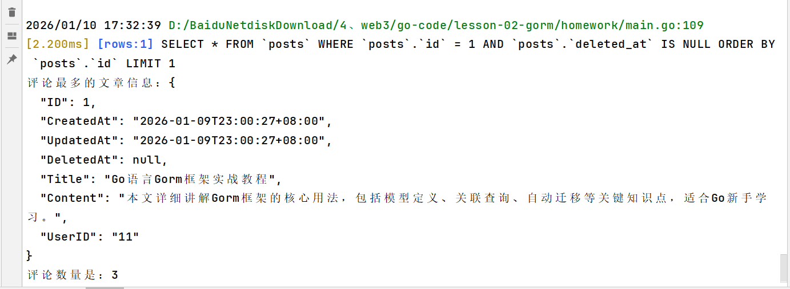 


## 题目3：钩子函数

- 继续使用博客系统的模型。
  - 要求 ：
    - 为 Post 模型添加一个钩子函数，在文章创建时自动更新用户的文章数量统计字段。
    - 为 Comment 模型添加一个钩子函数，在评论删除时检查文章的评论数量，如果评论数量为 0，则更新文章的评论状态为 "无评论"。

### 1. User和Post模型都需要新增字段

```go
// User 用户
type User struct {
	。。。
	Post_Count int    `gorm:"default:0;comment:用户发布的文章数量"` // 新增统计字段
}

// Post 文章类
type Post struct {
	。。。
	CommentStatus string `gorm:"default:'无评论';comment:评论状态（有评论/无评论）"` // 新增状态字段
}
```

新增用户表文章统计字段

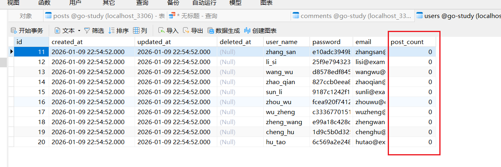 

新增文章表评论状态字段

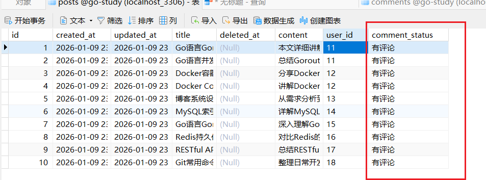 

### 2. 为 Post 模型添加一个钩子函数，在文章创建时自动更新用户的文章数量统计字段。

```go

// Post的钩子，创建后，更新用户文章数量
func (p *Post) AfterCreate(tx *gorm.DB) error {
	log.Printf("Post的钩子，创建后，更新用户文章数量")
	// 1. 校验用户ID是否有效
	if p.UserID == "" {
		log.Printf("警告：文章ID=%d 的用户ID为空，跳过文章数统计", p.ID)
		return nil
	}

	// 2. 更新用户文章数量，事务操作
	err := tx.Model(&User{}).
		Where("id = ?", p.UserID).
		Update("post_count", gorm.Expr("post_count + ?", 1)).Error

	if err != nil {
		log.Printf("更新用户ID=%d 的文章数失败：%v", p.UserID, err)
		return err
	}
	log.Println("用户文章数更新成功")
	return nil
}

// 为11号用户新建一个文章
func createPost(p *Post) error {
	if err := db.Create(p).Error; err != nil {
		// 处理错误
		log.Printf("创建文章失败：%v\n", err)
	}
	return nil
}


func main() {
	initDB()
	。。。
	// 题目3 为 Post 模型添加一个钩子函数，在文章创建时自动更新用户的文章数量统计字段。

	err := createPost(&Post{Title: "肖申克的救赎", Content: "肖申克的救赎真好看", UserID: "11"})
	log.Println(err)
}
```

运行效果

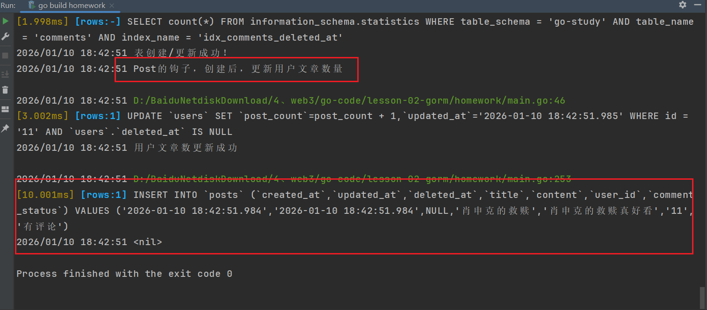 

查看数据库11号用户的统计数量

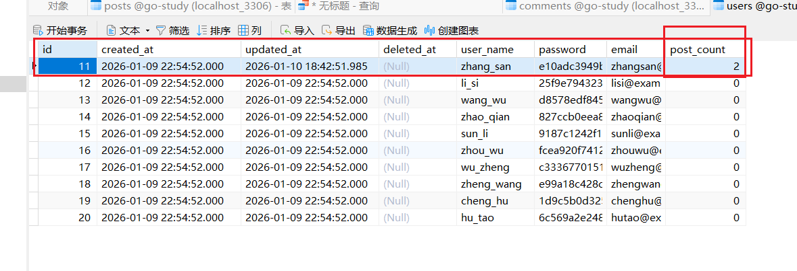 


### 3. 为 Comment 模型添加一个钩子函数，在评论删除时检查文章的评论数量，如果评论数量为 0，则更新文章的评论状态为 "无评论"。

删除10号文章的2条评论

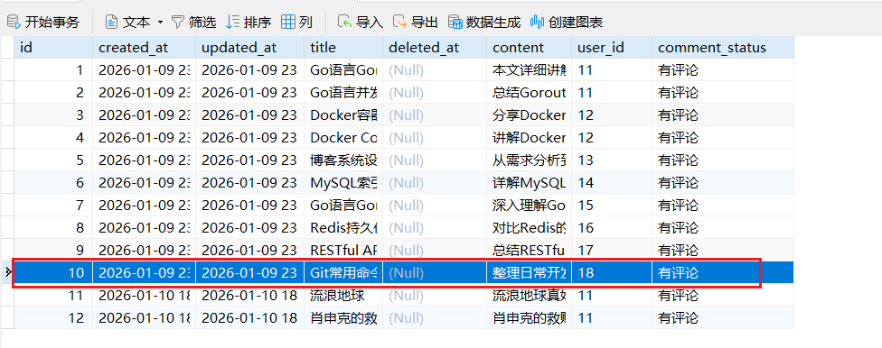 

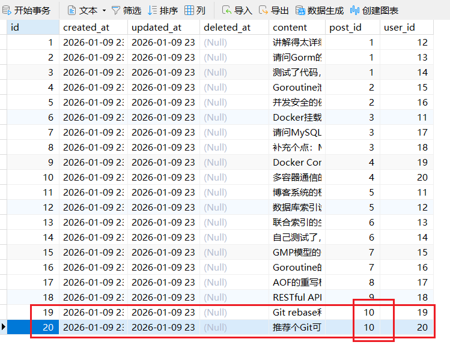 

注意：目前钩子只支持单条删除，批量的话会穿给钩子0值

```go
func deleteComments(cid []uint) error {// 这里不要批量
if err := db.Where("id in (?)", cid).Delete(&Comment{}).Error; err != nil {
		// 处理错误
		log.Printf("删除评论失败：%v\n", err)
	}
```

修正代码如下

```go

// 钩子，评论删除时，检查文章的评论数量.如果评论数量为 0，则更新文章的评论状态为 "无评论"。
func (c *Comment) AfterDelete(tx *gorm.DB) error {
	// 1.检查文章id是否有效
	if c.PostID == 0 {
		log.Printf("警告：评论ID=%d 的文章ID为空，跳过评论状态检查", c.ID)
		return nil
	}

	// 2. 统计当前文章的剩余有效评论
	var curPostCommentCount int64
	err := tx.Model(&Comment{}).Where("post_id = ? AND deleted_at IS NULL", c.PostID).
		Count(&curPostCommentCount).Error

	if err != nil {
		log.Printf("统计文章ID=%d 的评论数失败：%v", c.PostID, err)
		return err
	}

	// 3.更新posts表相应的字段
	var status string
	if curPostCommentCount == 0 {
		status = "无评论"
	} else {
		status = "有评论"
	}

	err = tx.Model(&Post{}).
		Where("id = ?", c.PostID).
		Update("comment_status", status).Error

	if err != nil {
		log.Printf("更新文章ID=%d 的评论状态失败：%v", c.PostID, err)
		return err
	}

	log.Println("评论删除后更新文章数量成功")
	return nil
}

// 删除
func deleteComments(cid uint) error {
	var comment Comment
	if err := db.First(&comment, cid).Error; err != nil {
		log.Printf("查询评论ID=%d 失败：%v\n", cid, err)
		return err
	}
	if err := db.Delete(&comment).Error; err != nil {
		// 处理错误
		log.Printf("删除评论失败：%v\n", err)
	}
	return nil
}

func main() {
	initDB()
	。。。
	// 题目4 为 Comment 模型添加一个钩子函数，在评论删除时检查文章的评论数量，如果评论数量为 0，则更新文章的评论状态为 "无评论"。
	var cid uint = 20
	err := deleteComments(cid)
	log.Println(err)
}
```

运行效果

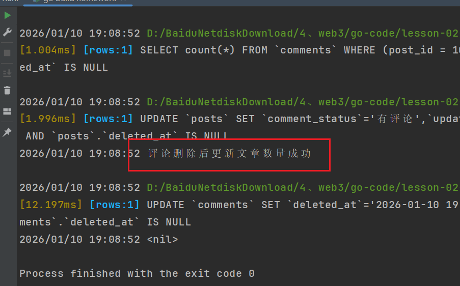 

两天评论删除

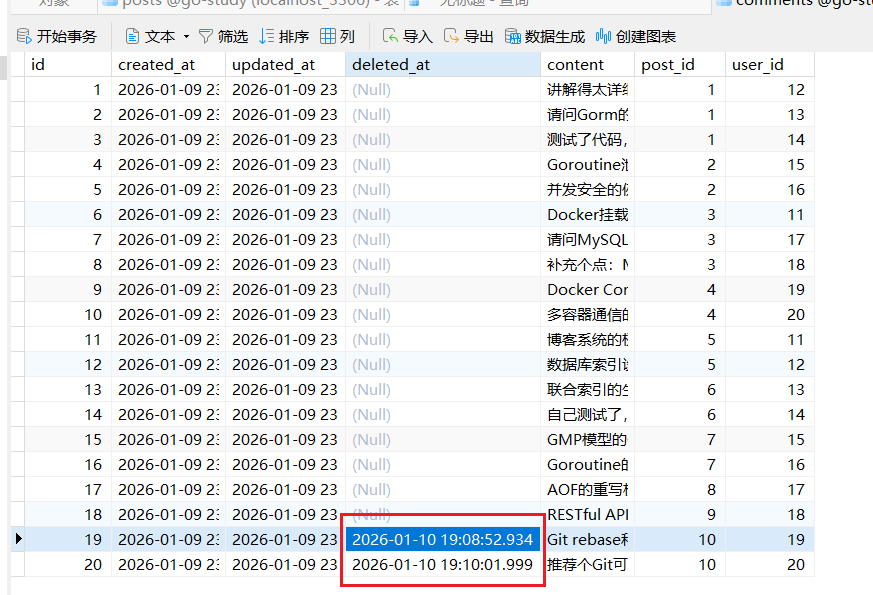 

相应的10号文章的状态已经做了修改

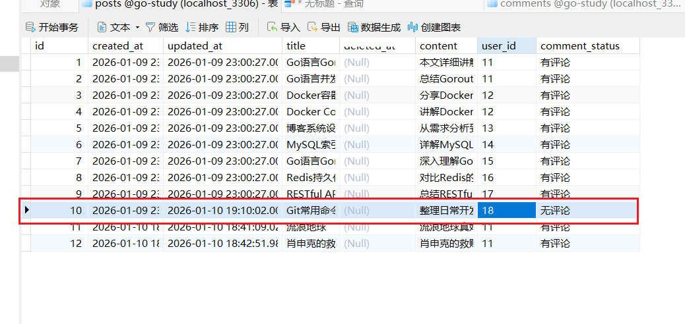 
