# 一、讨饭合约操作记录

## 部署合约

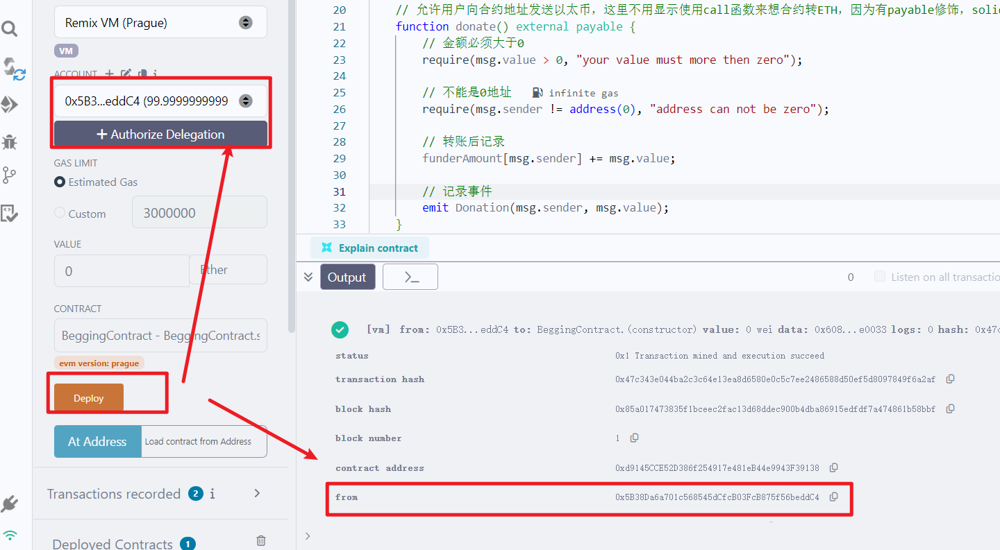 

## donate方法

- 换一个账号捐赠1个ETH触发事件

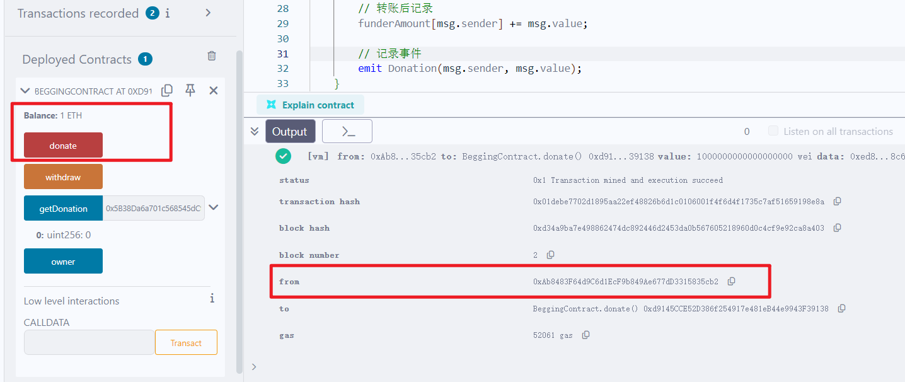 

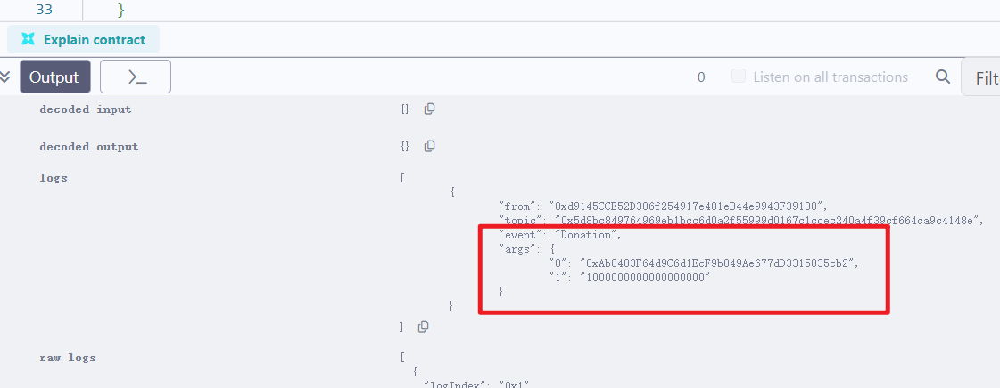 


## getDonation

- 获取某个捐赠者金额

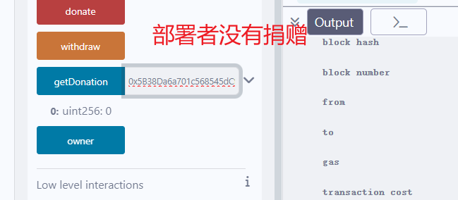 

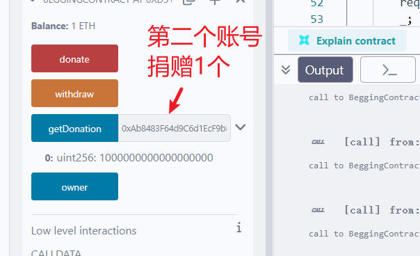 


## withdraw

- 合约所有者可以取现

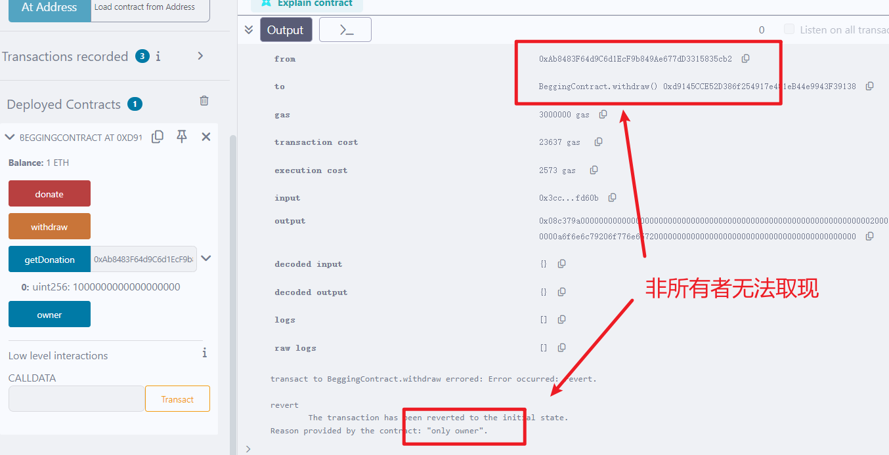 

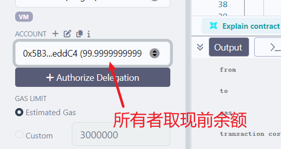 

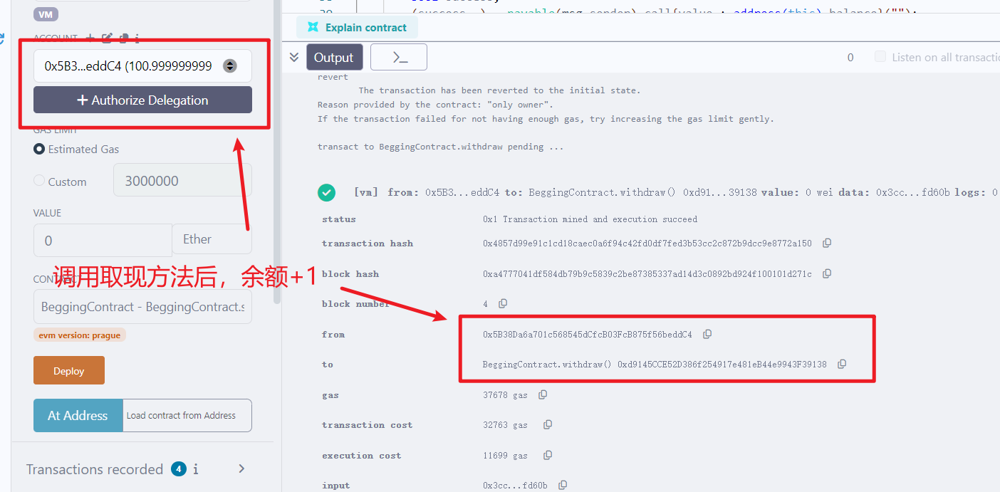 


## 捐赠排行榜

- 显示捐赠金额最多的前 3 个地址。
  - 考虑用一个address数组遍历，排序后取top3

```solidity
   
contract BeggingContract{
	。。。
    // 记录每个捐赠人的捐款金额
    mapping (address=>uint256) public funderAmount;
    
	// 记录捐赠人的数组
    address[] public addrs;
   
   // 显示捐赠金额最多的前三个地址
        // 使用一个数组单独维护地址，冒泡排序后取前三个
    function getTop3() external returns(address[] memory, uint256[] memory){
        uint256 arrLen = addrs.length;
        for(uint256 i = 0; i < arrLen; i++){
            for(uint256 j = 0; j < arrLen-i-1; j++){
                if (funderAmount[addrs[j]] < funderAmount[addrs[j+1]]){
                    address temp = addrs[j];
                    addrs[j] = addrs[j+1];
                    addrs[j+1] = temp;
                }
            }
        }

        // 构造结果
        uint256 resLen = arrLen < 3 ? arrLen : 3;
        address[] memory resArr = new address[](resLen);
        uint256[] memory resAmount = new uint256[](resLen);

        // 取addrs的前resLen个
        for(uint256 i = 0; i < resLen; i++){
            resArr[i] = addrs[i];
            resAmount[i] = funderAmount[addrs[i]];
        }
        return (resArr, resAmount);
    }

    function getAddrsLen() external view returns(uint256){
        return addrs.length;
    }


    function getAddrs() external view returns(address[] memory){
        return addrs;
    }
```

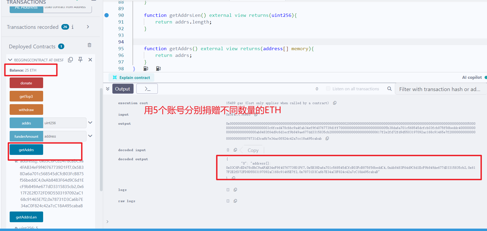 

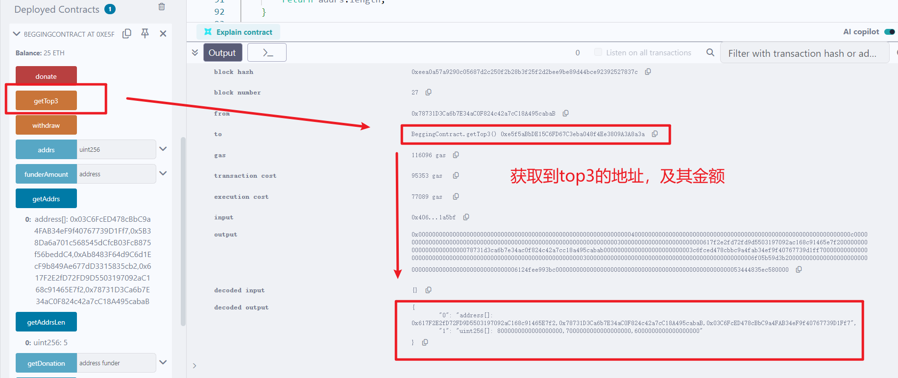 


## 时间限制

- 添加一个时间限制，只有在特定时间段内才能捐赠。

```
    。。。
    function donate() external payable {
        // 必须特定时间才能捐赠
        require(block.timestamp < deployTime + deadline, "window is closed
        
    function withdraw() external onlyOwner{
        // 必须等捐赠窗口结束才能提现
        require(block.timestamp >= deployTime + deadline, "window is not closed");
```

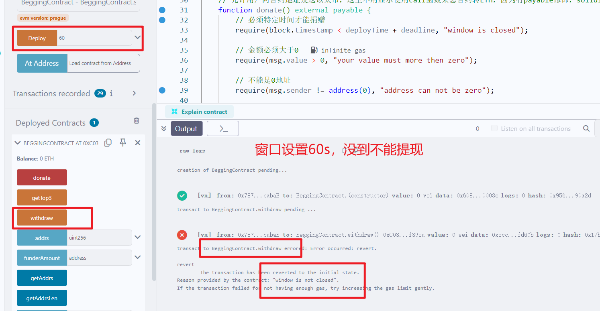 

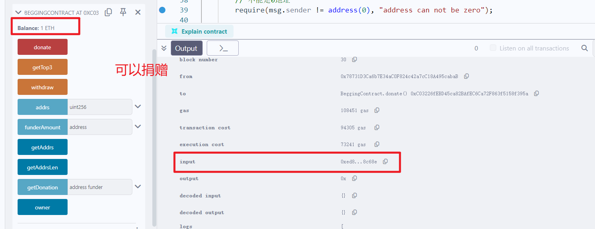 

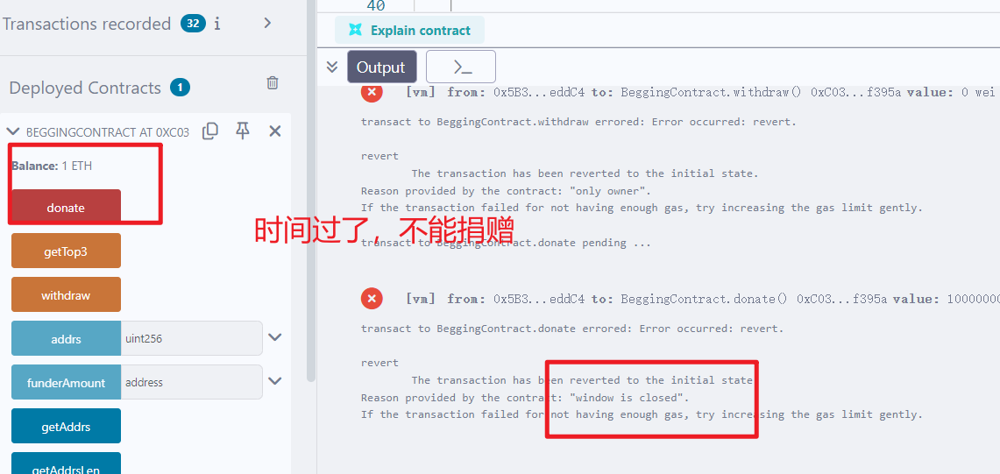 

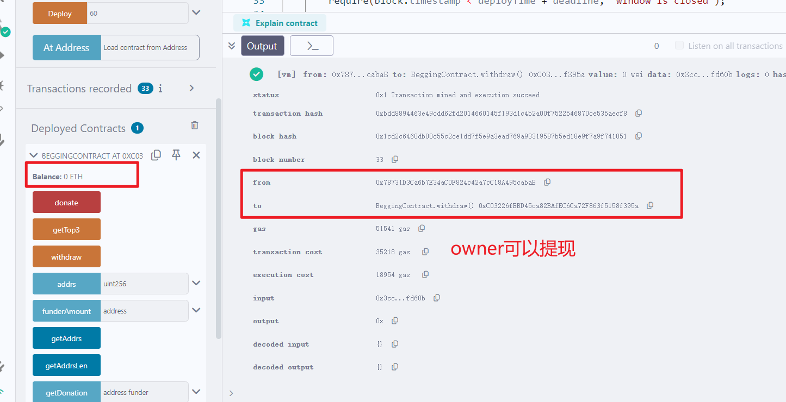 


# 二、完整代码

```solidity
// SPDX-License-Identifier: MIT
pragma solidity ^0.8.24;

contract BeggingContract{

    // 合约所有者
    address public owner;

    // 记录每个捐赠人的捐款金额
    mapping (address=>uint256) public funderAmount;

    address[] public addrs;

    // 事件
    event Donation(address addr, uint256 amount);

    // 截止时间
    uint256 private deadline;

    // 部署时间
    uint256 private deployTime;

    // 构造器
    constructor(uint256 _deadline){
        owner = msg.sender;
        deadline = _deadline;
        deployTime = block.timestamp;
    }

    // 允许用户向合约地址发送以太币，这里不用显示使用call函数来想合约转ETH，因为有payable修饰，solidity会自动处理
    function donate() external payable {
        // 必须特定时间才能捐赠
        require(block.timestamp < deployTime + deadline, "window is closed");

        // 金额必须大于0
        require(msg.value > 0, "your value must more then zero");

        // 不能是0地址
        require(msg.sender != address(0), "address can not be zero");

        // 第一次捐款，就存入数组
        if (funderAmount[msg.sender] == 0){
            addrs.push(msg.sender);
        }

        // 转账后记录
        funderAmount[msg.sender] += msg.value;
        
        // 记录事件
        emit Donation(msg.sender, msg.value);
    }


    // 允许合约所有者提取所有捐赠的资金
    function withdraw() external onlyOwner{
        // 必须等捐赠窗口结束才能提现
        require(block.timestamp >= deployTime + deadline, "window is not closed");

        bool success;
        (success, ) = payable(msg.sender).call{value : address(this).balance}("");
        require(success, "tx failed");

        // 投资记录也要清零
        funderAmount[msg.sender] = 0;
    }

    // 获取某个捐赠者金额
    function getDonation(address funder) external view returns(uint256){
        return funderAmount[funder];
    }

    modifier onlyOwner(){
        require(msg.sender == owner, "only owner");
        _;
    }

    // 显示捐赠金额最多的前三个地址
        // 使用一个数组单独维护地址，冒泡排序后取前三个
    function getTop3() external returns(address[] memory, uint256[] memory){
        uint256 arrLen = addrs.length;
        for(uint256 i = 0; i < arrLen; i++){
            for(uint256 j = 0; j < arrLen-i-1; j++){
                if (funderAmount[addrs[j]] < funderAmount[addrs[j+1]]){
                    address temp = addrs[j];
                    addrs[j] = addrs[j+1];
                    addrs[j+1] = temp;
                }
            }
        }

        // 构造结果
        uint256 resLen = arrLen < 3 ? arrLen : 3;
        address[] memory resArr = new address[](resLen);
        uint256[] memory resAmount = new uint256[](resLen);

        // 取addrs的前resLen个
        for(uint256 i = 0; i < resLen; i++){
            resArr[i] = addrs[i];
            resAmount[i] = funderAmount[addrs[i]];
        }
        return (resArr, resAmount);
    }

    function getAddrsLen() external view returns(uint256){
        return addrs.length;
    }


    function getAddrs() external view returns(address[] memory){
        return addrs;
    }
}
```

