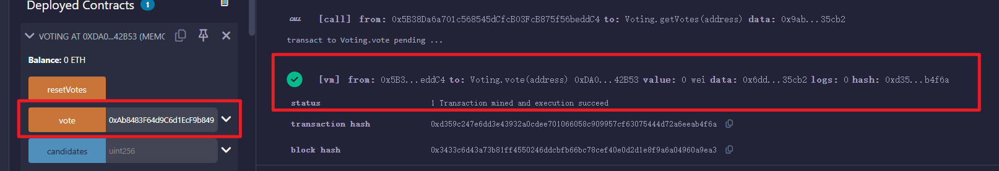
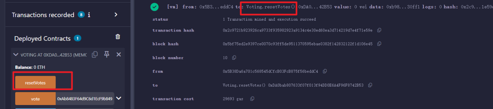
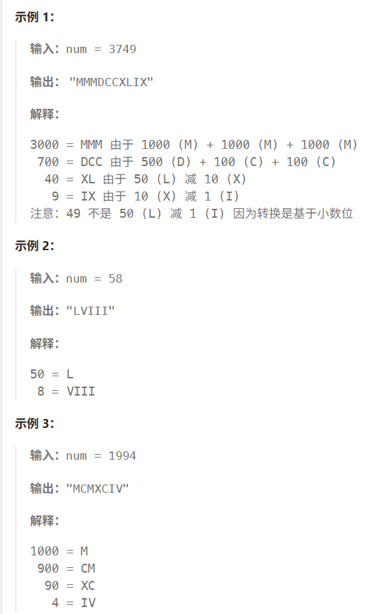
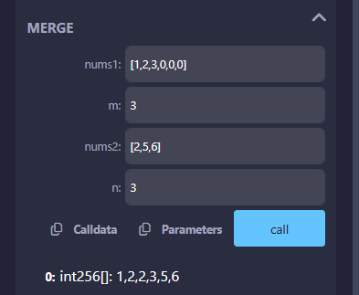
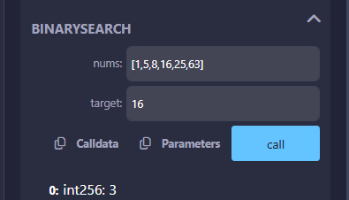
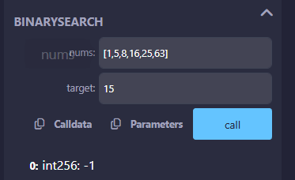

# 一、创建一个名为Voting的合约

## code

```solidity
// SPDX-License-Identifier: MIT
pragma solidity ^0.8.21;


contract Voting{

    // 一个mapping存储候选人的得票数
    mapping (address => uint256) public votesReceived; // candidate => vote count

    // 同时记录mapping中的候选人，方便后续遍历清除
    address [] public candidates;

    // vote函数，允许用户投票给某个候选人
    function vote(address _candidate) public {
        // 如果是新候选人，加入数组
        if (votesReceived[_candidate] == 0) {
            candidates.push(_candidate);
        }
        
        // 将投票者的地址作为键，将其投票数作为值存储在mapping中
        votesReceived[_candidate] += 1;
    }

    // 一个getVotes函数，返回某个候选人的得票数量
    function getVotes(address _candidate) public view returns (uint256) {
        return votesReceived[_candidate];
    }

    // 一个resetVotes函数，重置所有候选人的得票数
    function resetVotes() public {
        for (uint256 i = 0; i < candidates.length; i++) {
            // 将 Mapping 中的值设为 0（这会退还一部分 Gas，但遍历本身很贵）
            delete votesReceived[candidates[i]];
        }
        
        // 最后清空候选人数组
        delete candidates; 
    }
}
```

## 投票

 

## 查看得票数

 

## 重置所有候选人得票

  

 


# 二、反转字符串

## code

```solidity
// SPDX-License-Identifier: MIT
pragma solidity ^0.8.21;

contract ReverseInPlace{

    // 原地反转字符串
    function reverseInPlace(string memory _str) public pure returns (string memory) {
        bytes memory s = bytes(_str);
        uint256 len = s.length;
        for (uint256 i = 0; i < len / 2; i++) {
            // 首尾交换
            bytes1 temp = s[i];
            s[i] = s[len - i - 1];
            s[len - i - 1] = temp;
        }
        return string(s);
    }
}
```

## 测试

 


# 三、整数转罗马数字

## code

```solidity
    function intToRoman(uint256 num) public pure returns (string memory) {
        require(num > 0 && num < 4000, "Number out of range (1-3999)");

        // 对应 Java 中的二维数组 c
        // 定义个位、十位、百位、千位的查表数据
        string[10] memory units = ["", "I", "II", "III", "IV", "V", "VI", "VII", "VIII", "IX"];
        string[10] memory tens = ["", "X", "XX", "XXX", "XL", "L", "LX", "LXX", "LXXX", "XC"];
        string[10] memory hundreds = ["", "C", "CC", "CCC", "CD", "D", "DC", "DCC", "DCCC", "CM"];
        string[4] memory thousands = ["", "M", "MM", "MMM"];

        // 从高到低拼接
        return string.concat(
            thousands[(num / 1000) % 10],   // 千位
            hundreds[(num / 100) % 10],     // 百位
            tens[(num / 10) % 10],          // 十位
            units[num % 10]                 // 个位
        );
    }
```

## 测试

 

 

 

 

跟leetcode上面的示例一致

 


# 四、罗马数字转整数

## code

```solidity
    // 罗马转数字
    function romanToInt(string memory s) public pure returns (int256) {
        bytes memory b = bytes(s);
        int256 n = int256(b.length);
        if (n == 0) return 0;

        // 1. 将数组类型改为 int256
        int256[] memory nums = new int256[](uint256(n));

        for (uint256 i = 0; i < uint256(n); i++) {
            bytes1 char = b[i];
            if (char == "M") nums[i] = 1000;
            else if (char == "D") nums[i] = 500;
            else if (char == "C") nums[i] = 100;
            else if (char == "L") nums[i] = 50;
            else if (char == "X") nums[i] = 10;
            else if (char == "V") nums[i] = 5;
            else if (char == "I") nums[i] = 1;
            else revert("Invalid Roman character");
        }

        // 2. 将 sum 改为 int256，这样它就可以变成 -1 了
        int256 sum = 0;
        for (uint256 i = 0; i < uint256(n) - 1; i++) {
            if (nums[i] < nums[i + 1]) {
                sum -= nums[i]; // 这里 sum 会变成负数，int256 支持这种操作
            } else {
                sum += nums[i];
            }
        }

        // 3. 加上最后一个数字，转回正数
        return sum + nums[uint256(n) - 1];
    }
```

## 测试

 

 

 

 

 


# 五、合并两个有序数组

## code

```solidity
    // 合并两个有序数组
    function merge(int256[] memory nums1, uint256 m, int256[] memory nums2, uint256 n) public pure returns (int256[] memory) {
        
        uint256 i = m;
        uint256 j = n;
        uint256 index = m + n;

        // 大的数字，填充到num1的末尾，相等时，先移动num1，腾出无效位置
        while (i > 0 && j > 0) {
            if (nums1[i - 1] >= nums2[j - 1]) {
                nums1[index - 1] = nums1[i - 1];
                i--;
            } else {
                nums1[index - 1] = nums2[j - 1];
                j--;
            }
            index--;
        }
        
        // 处理 nums2 剩余部分
        while (j > 0) {
            nums1[index - 1] = nums2[j - 1];
            j--;
            index--;
        }

        return nums1;
    }
```


## 测试

 


# 六、二分查找

## code

```solidity
    // 二分查找
    function binarySearch(int256[] memory nums, int256 target) public pure returns (int256) {
        if (nums.length == 0) return -1;

        uint256 left = 0;
        uint256 right = nums.length - 1;

        while (left <= right) {
            // 防止 (left + right) 溢出的标准写法
            uint256 mid = left + (right - left) / 2;

            if (nums[mid] == target) {
                return int256(mid); // 找到目标，转换类型返回
            } else if (nums[mid] < target) {
                left = mid + 1;
            } else {
                // mid不能为负数
                if (mid == 0) break; 
                right = mid - 1;
            }
        }

        return -1; // 未找到
    }
```


## 测试

 

 
