# 一、创建专属代币

## 1.1 账户情况

目前有2个账户连接到sepolia测试网，如下所示，由...13099来创建讨饭合约并铸币

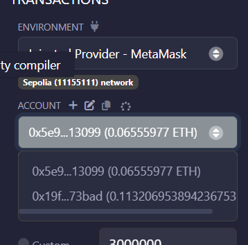  

## 1.2 部署代币合约

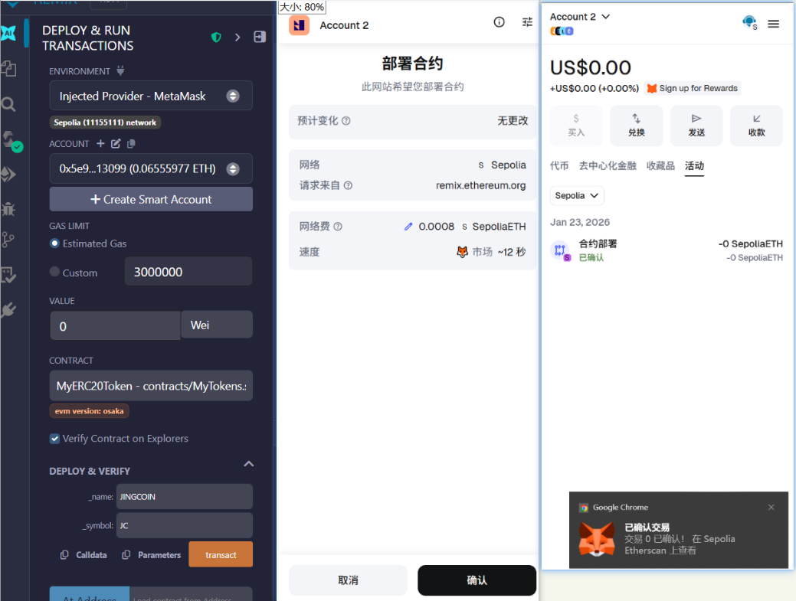  

## 1.3 铸造代币/添加代币

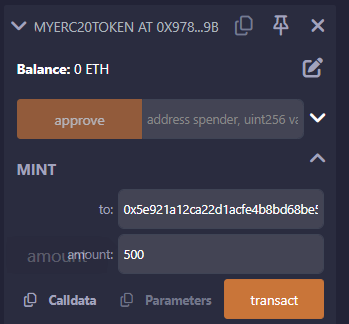 

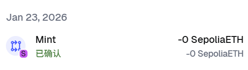 

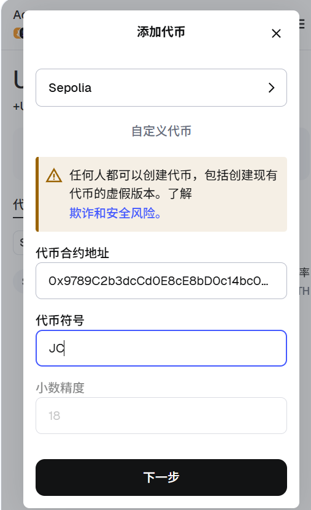 

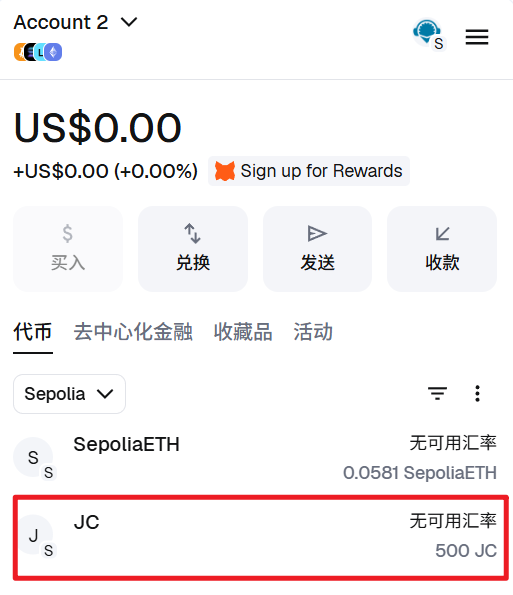 


# 二、讨饭合约

## 2.1 部署

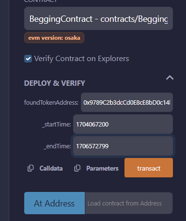 

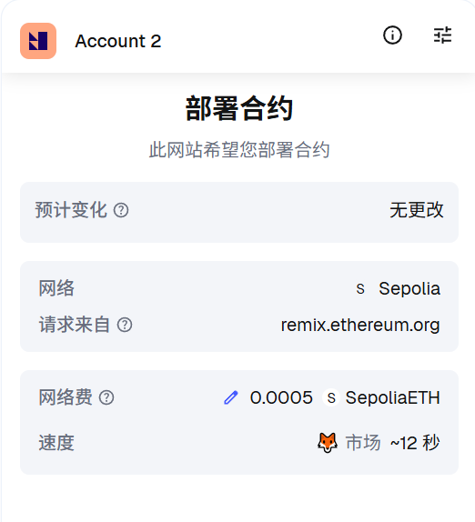 

## 2.2 给讨饭合约铸造代币

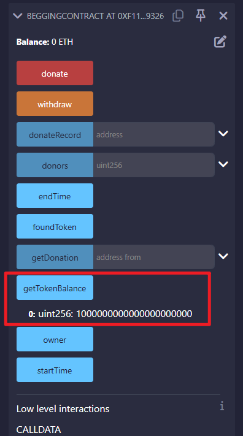 

## 2.3 捐赠

...73bad账户给合约捐赠0.006个ETH

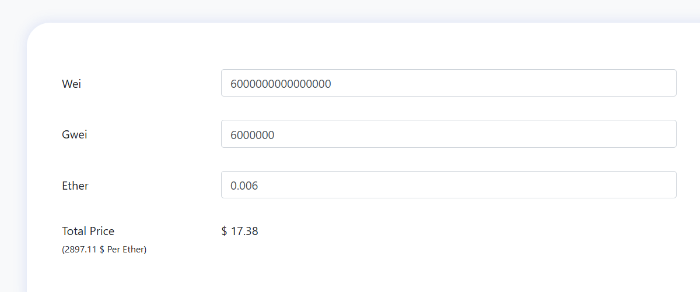

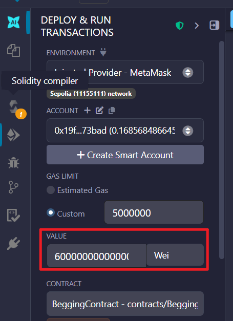    

 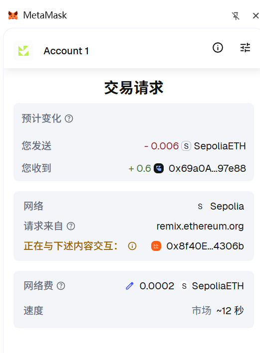 

讨饭合约收到捐赠的0.006个ETH

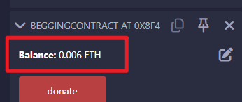 


## 2.4 账户自定义代币数量来到0.6个

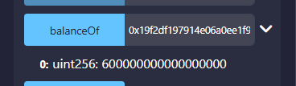 

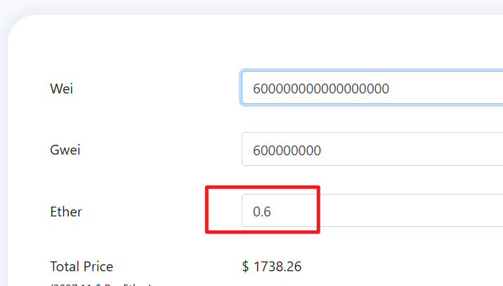 

## 2.5 领取自定义代币

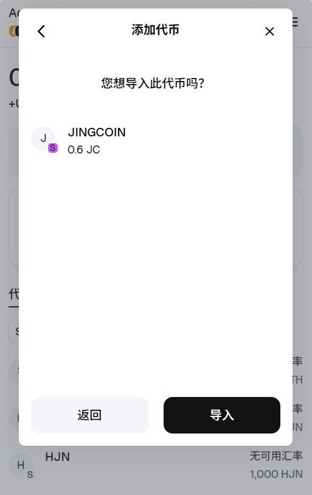 


## 2.6 取现

取现到合约创造者账户...13099

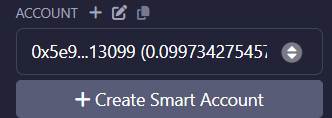 

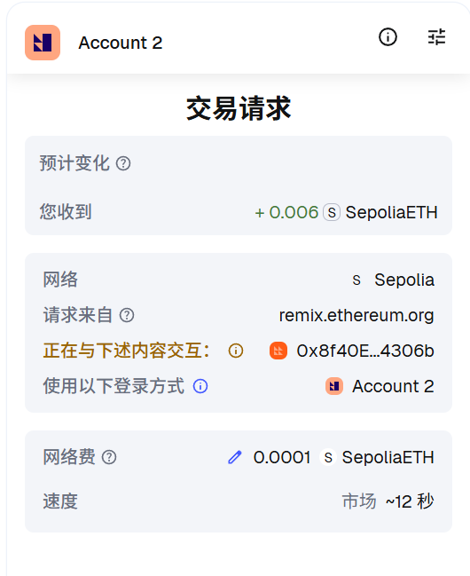 

取现成功，账户余额增加

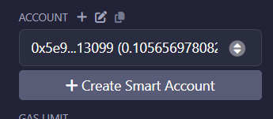 

区块交易记录

 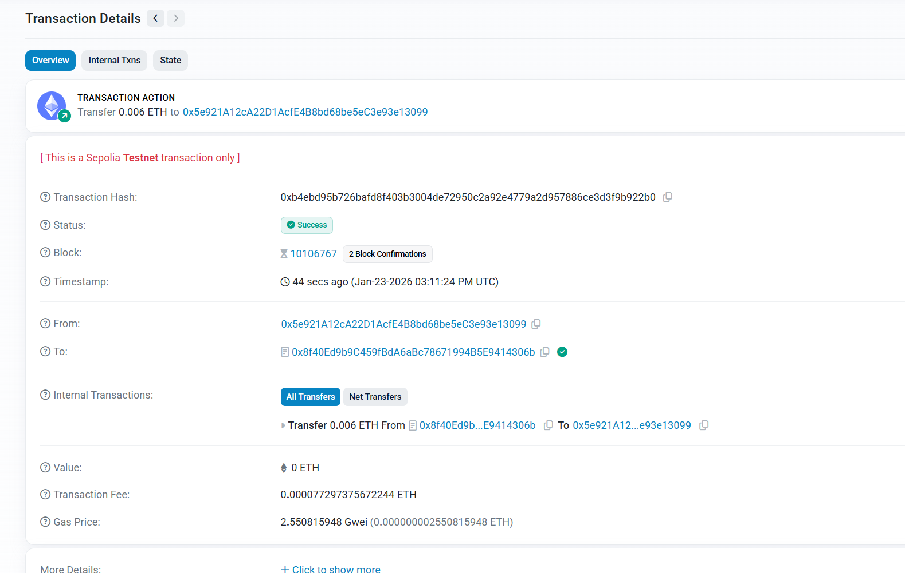 

## 2.7 根据捐赠人地址获取金额

输入账户...13099即可查询

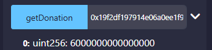 


# 三、扩展

## 3.1 捐赠必须是指定时间内

比如捐赠是在1月1号0点开始，1月10号24点结束

```
2025-01-01 00:00:00 → 时间戳：`1704067200`
2025-01-10 23:59:59 → 时间戳：`1704931199`
1706572799
```

部署时传入构造器，点击捐赠报错如下：

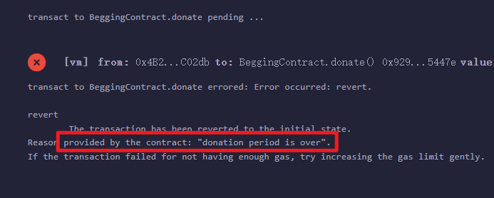 


## 3.2 捐赠时触发事件

记录捐赠人地址和捐赠数量

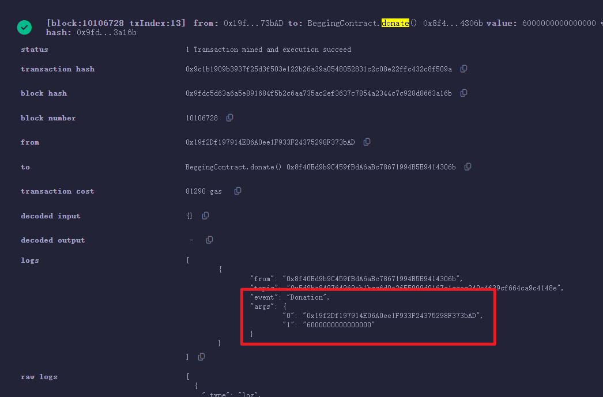 


# 四、其他

## 4.1 合约代码

### 4.1.1 token代码

```solidity
// SPDX-License-Identifier: MIT
pragma solidity ^0.8.21;

import "@openzeppelin/contracts/token/ERC20/ERC20.sol";


contract MyERC20Token is ERC20 {

    constructor(string memory _name, string memory _symbol) ERC20(_name, _symbol){

    }

    // 定义铸币方法
    function mint(address to, uint256 amount) public{
        _mint(to, amount * 10 ** 18);
    }
}

```


### 4.1.2 合约代码

```solidity
// SPDX-License-Identifier: MIT
pragma solidity ^0.8.21;

interface IERC20 {
    // 转账
    function transfer(address to, uint256 amount) external returns (bool);

    // 查看代币余额
    function balanceOf(address account) external view returns (uint256);
}

contract BeggingContract{

    // mapping记录每个捐赠者的地址和捐赠金额
    mapping (address => uint) public donateRecord;
    
    // 合约所有者
    address public owner;

    // 自定义代币
    IERC20 public foundToken;

    // 开始和结束时间内才能捐赠
    uint256 public startTime;
    uint256 public endTime;

    // 构造器 初始化合约owner和自定义代币 foundTokenAddress是一个实现了tranfer的接口，到时候直接使用代币合约地址.transfer进行交易
    constructor(address foundTokenAddress, uint256 _startTime) {
        foundToken = IERC20(foundTokenAddress);
        owner = msg.sender;
        startTime = _startTime;
        endTime = _startTime + 3600;
    }

    // onlyOnwer拦截器
    modifier onlyOwner() {
        require(msg.sender == owner, "only owner opt");
        _;
    }

    // 只有在特定时间内才能捐赠
    modifier onlyDuringDonationPeriod() {
        require(block.timestamp >= startTime && block.timestamp <= endTime, "donation period is over");
        _;
    }

    // 捐赠事件：添加 Donation 事件，记录每次捐赠的地址和金额。
    event Donation(address indexed from, uint amount);
    
    // 一个 donate 函数，允许用户向合约发送以太币，并记录捐赠信息。
    function donate() external payable onlyDuringDonationPeriod{
        // 向map中push捐赠记录
        donateRecord[msg.sender] = msg.value;

        // 返还给用户 1:100 的自定义代币
        foundToken.transfer(msg.sender, msg.value * 100);

        emit Donation(msg.sender, msg.value);
    }

    // 一个 withdraw 函数，只允许合约所有者提取合约中的所有以太币。
    function withdraw() external onlyOwner{
        // 将合约中的所有以太币发送给owner
        payable(msg.sender).transfer(address(this).balance); // 直接通过 地址.balance可以获取到当前合约的余额
    }

    // 查询某个地址的捐赠金额
    function getDonation (address from) external view returns(uint){
        return donateRecord[from];
    }

    // 查看当前合约的自定义代币余额
    function getTokenBalance() external view returns(uint){
        return foundToken.balanceOf(address(this));
    }
}
```


## 4.2 合约地址

```
0x8f40Ed9b9C459fBdA6aBc78671994B5E9414306b
```


# 五、遇到的问题

固定开始时间戳和结束时间戳后，donate捐款函数老是不成功，捐款结束时间修改为当前时间加上3600秒即可
