# 一、NFT 拍卖市场

## 1. 初始化项目

```
npm install hardhat@3.1.0 --save-dev
npx hardhat --init
```

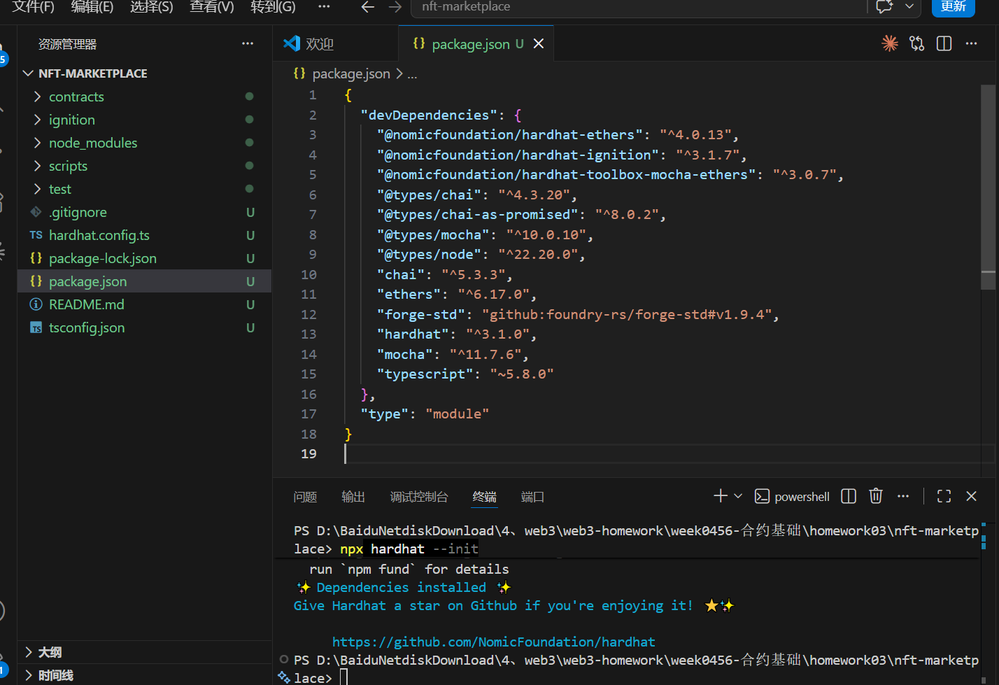 


## 2. 构建ERC721合约

来到这个链接：https://www.openzeppelin.com/solidity-contracts

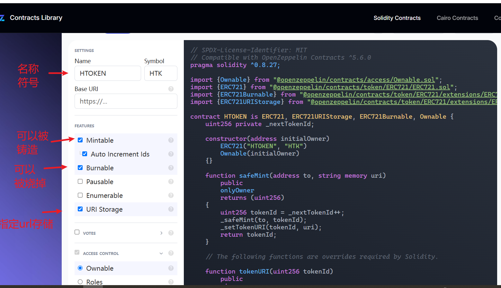 

## 3. 去中心化存储

我们要将NFT的metadata存入到IPFS上面，直接存的话，要搭建环境，比较贵。

我们还有一些其他的公司，基于IPFS网络，去提供一些服务，比如filebase

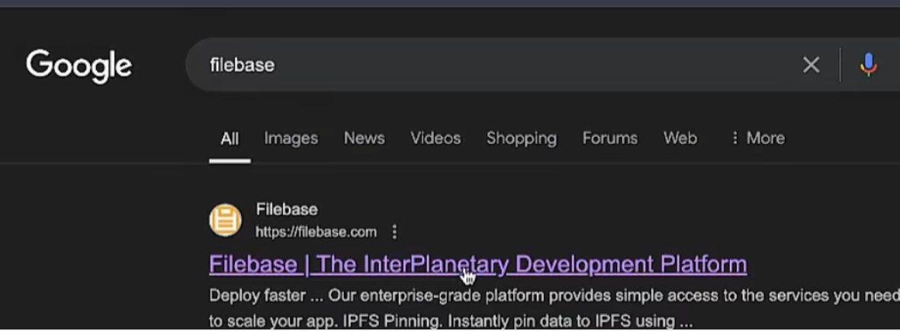 

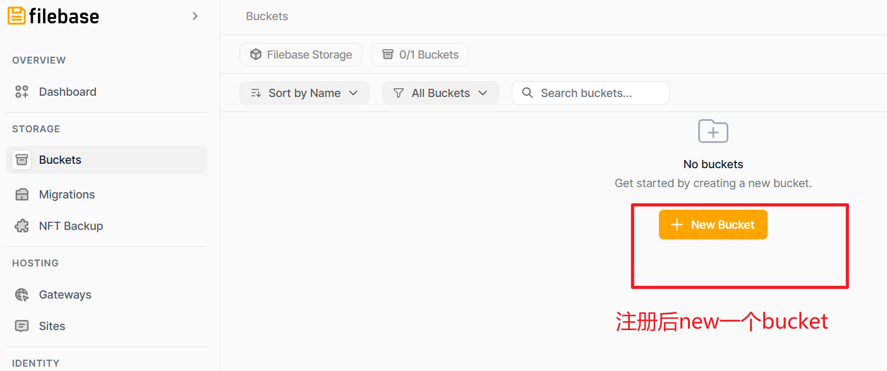 

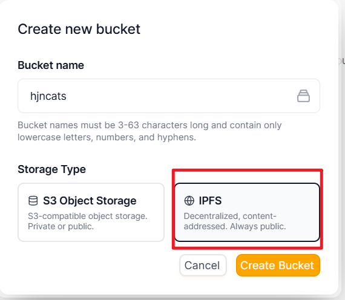 

上传一张图片，获取到gateway url

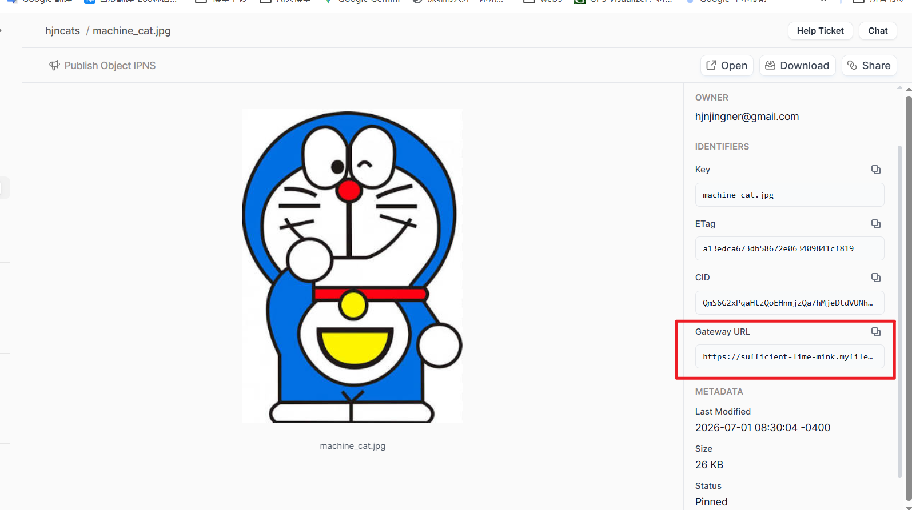 

在合约铸造中指定url

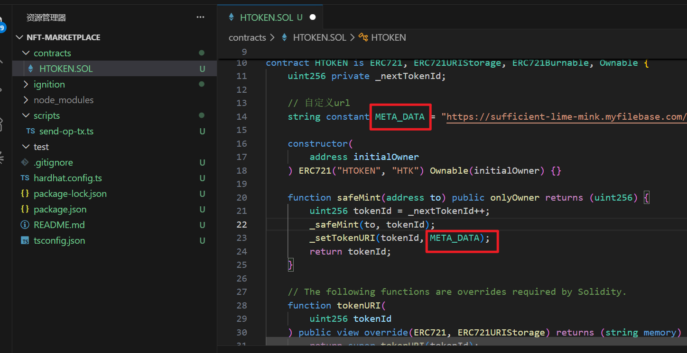 

测试效果，在remix上部署，将NFT mint到我们指定的地址，使用account1进行部署

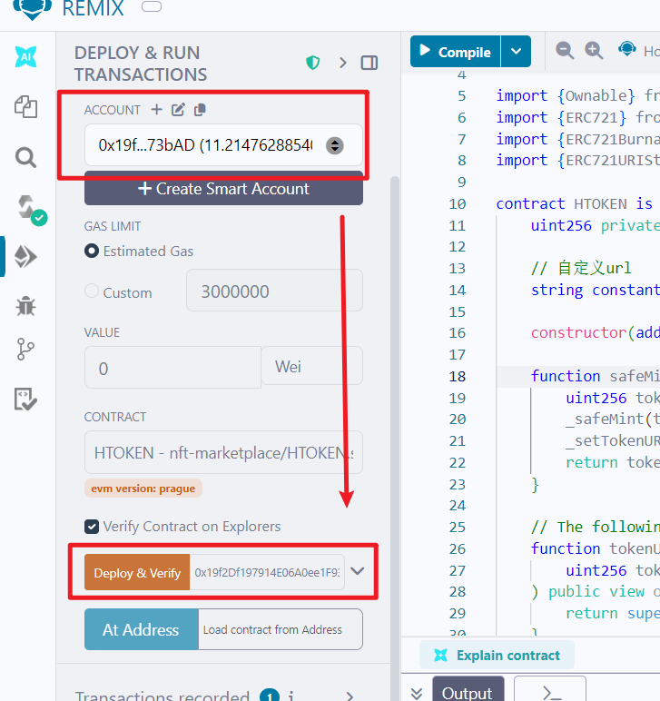 

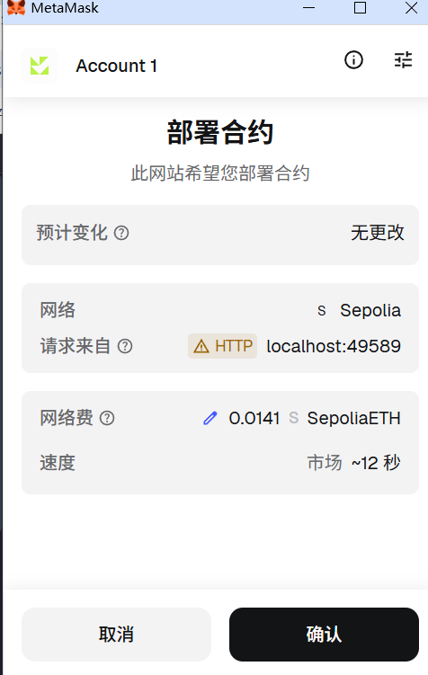 

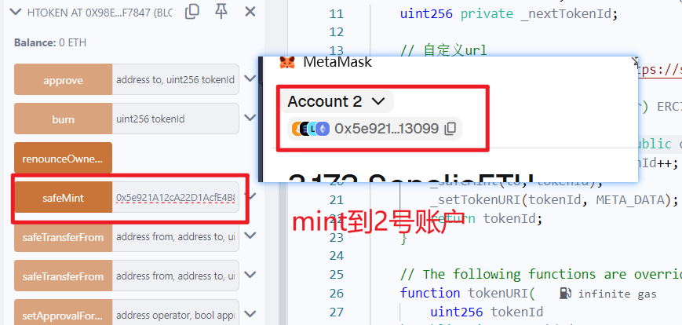 

查看mint过来的nft

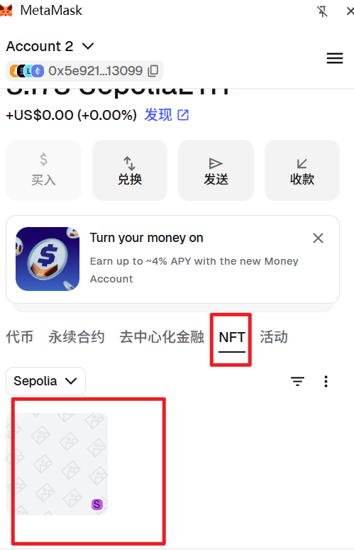 

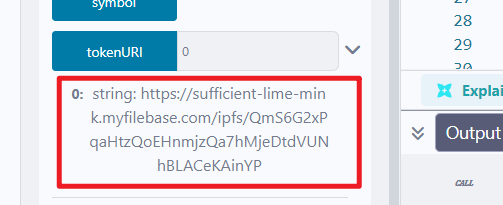 

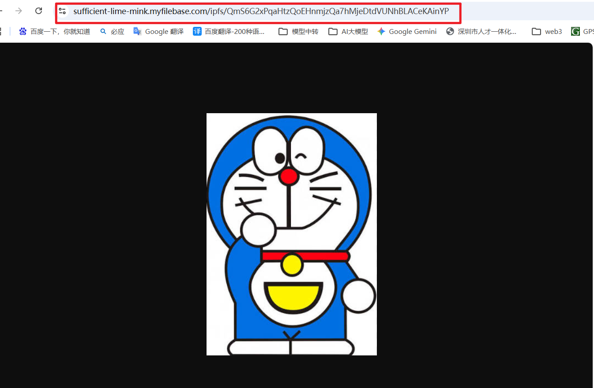 


## 4. NFT合约内容完善

除了ERC721合约规定的基本操作外，还应该对NFT加上一些限制：

- 铸造要花费一定的ETH，同时限定最大供应链，避免无限铸造
- 铸造事件跟踪
- 合约所有者可以提取铸造的费用

```solidity
// 添加一些限制条件和事件追踪
function safeMint(address to) public payable onlyOwner returns (uint256) {
    // 不能超过最大供应量
    require(_nextTokenId < MAX_SUPPLY, "more then MAX_SUPPLY");

    // 调用者的余额要大于mint_price
    require(msg.value < MINT_PRICE, "you have no enough money to mint");

    uint256 tokenId = _nextTokenId++;
    _safeMint(to, tokenId);
    _setTokenURI(tokenId, META_DATA);

    // 事件跟踪
    emit NFTMinted(msg.sender, to, tokenURI(tokenId));
    return tokenId;
}


// 合约所有者可以withdraw相应的余额，因为每次mint都要支付一定的手续费
function withdraw() external {
    uint256 balance = address(this).balance;
    require(balance > 0, "balance is not enough");
    require(msg.sender == owner(), "only owner");

    bool success;
    (success, ) = owner().call{value: balance}("");
    require(success, "tx failed!");
}
```

## 5. 环境变量配置

使用env-enc加密存储环境变量

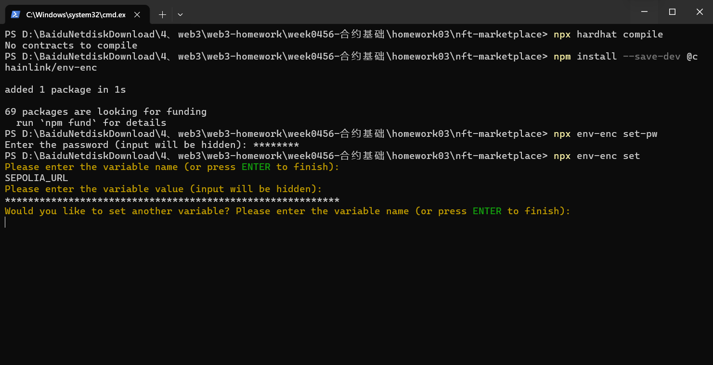 

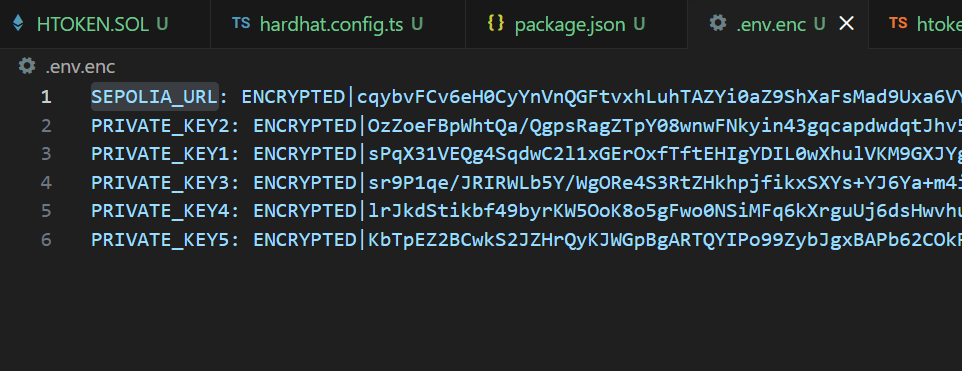 


## 6. 安装hardhat-deploy插件

npm install -D hardhat-deploy

- 主要为了解决获取合约实例后的类型问题
- 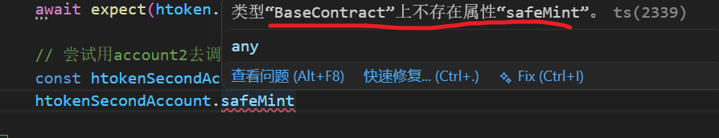 


## 7. 编写合约

分别编写如下合约，以满足需求，各合约功能如下

```powershell
nft-marketplace/
├── contracts/
│   ├── HToken.sol                          # ERC721 NFT 合约（测试用）
│   ├── NFTAuction.sol                      # 原始不可升级拍卖合约
│   ├── NFTAuctionUpgradeable.sol           # 可升级拍卖合约 V1
│   ├── NFTAuctionV2.sol                    # 升级版本 V2（支持 ERC20 出价）
│   ├── TransparentUpgradeableProxy.sol     # 透明代理合约
│   ├── ProxyAdmin.sol                      # 代理管理员合约
│   ├── dataFeed/
│   │   └── PriceOracleRouter.sol           # Chainlink 价格预言机路由器
│   └── mocks/
│       ├── MyMockV3Aggregator.sol          # Chainlink Mock 喂价合约
│       └── MockERC20.sol                   # 测试用 ERC20 代币合约
```

## 8. 测试

### 8.1 测试报告

🍊NFT合约测试（hToken.test.ts）

```powershell
PS D:\BaiduNetdiskDownload\4、web3\web3-homework\week0456-合约基础\homework03\nft-marketplace> npx hardhat test .\test\hToken.test.ts
No contracts to compile
Running Mocha tests


  HToken
    √ safeMint: test connect fixture (61ms)
    √ safeMint: test owner call safeMint
    √ safeMint: test mint event send successfully
    √ safeMint: test contract get eth after owner call safeMint
    √ safeMint: can't more then max supply
    √ safeMint: test caller's balance must more then mint_price
    √ withdraw: only owner and balance check
    √ withdraw: contract's balance is zero, can not withdraw


  8 passing (107ms)


8 passing (8 mocha)
```


🍊拍卖市场合约测试（nftAuction.test.ts）

```powershell
PS D:\BaiduNetdiskDownload\4、web3\web3-homework\week0456-合约基础\homework03\nft-marketplace> npx hardhat test .\test\nftAuction.test.ts
No contracts to compile
Running Mocha tests


  NFTAuction
    CreateAuction
      √ Should reject zero address fro nftcontract param (90ms)
      √ Should set startPrice
      √ Should durationTime must at least 1 hour
      √ Should nft's owner is the tx sender
      √ Should seller approve the NFT to auction contract
      √ Should emit the event for auction
    PlaceBid
      √ Should auction is active
      √ Should placedBid must be time is not over
      √ Should reject if seller placeBid to himself
      √ Should reject if price less then 5% of last price
      √ Should record before placeBid
    EndAuction
      √ Should reject cause auction is closed
      √ Should reject cause auction is not closed
      √ Should caculate correct for fee and sellerAmount
      √ Should caculate correct for fee and sellerAmount
    MockV3Aggregator
      √ Should get the mock price of ETH


  16 passing (270ms)


16 passing (16 mocha
```

🍊拍卖合约升级版本测试（nftAuctionV2.test.ts）

```powershell
PS D:\BaiduNetdiskDownload\4、web3\web3-homework\week0456-合约基础\homework03\nft-marketplace> npx hardhat test .\test\nftAuctionV2.test.ts
No contracts to compile
Running Mocha tests


  NFTAuctionV2
    CreateAuction
      √ Should reject zero address for nftContract param (134ms)
      √ Should reject when startPrice is zero
      √ Should reject when durationTime less than 1 hour
      √ Should reject if caller is not the NFT owner
      √ Should reject if NFT not approved to auction contract
      √ Should emit AuctionCreated event on success
    PlaceBid (ETH)
      √ Should reject if auction is not active
      √ Should reject if auction time has ended
      √ Should reject if seller tries to bid on own auction
      √ Should reject if bid is less than 5% above highest bid
      √ Should correctly record pending refunds for outbid bidders
      √ Should emit BidPlaced event on successful bid
    PlaceBidWithERC20
      √ Should reject zero token address
      √ Should reject zero amount
      √ Should reject if auction is not active
      √ Should reject if auction has ended
      √ Should reject if seller bids on own auction
      √ Should reject if bid amount is below startPrice (first bid)
      √ Should reject if bid amount is less than 5% above highest bid
      √ Should lock the token type on first bid and reject mismatched tokens
      √ Should transfer ERC20 tokens from bidder to contract
      √ Should record pending refunds for outbid bidders (ERC20)
      √ Should emit BidPlacedWithERC20 event on successful bid
    Mixed Bidding
      √ Should allow ETH-only auction to coexist with ERC20-only auction
      √ Should reject ETH bid on ERC20-locked auction
    EndAuctionV2
      ETH Settlement
        √ Should reject if auction is already closed
        √ Should reject if auction time has not ended
        √ Should correctly settle: transfer NFT, pay seller and feeReceiver (ETH)
        √ Should emit AuctionEnd with zero winner when no bids placed
      ERC20 Settlement
        √ Should correctly settle ERC20 auction: transfer NFT and tokens
        √ Should emit AuctionEnd on ERC20 settlement
    WithdrawV2
      ETH Withdraw
        √ Should reject withdraw if auction is still active
        √ Should reject withdraw if no refund available
        √ Should correctly refund ETH to outbid bidders
        √ Should clear pending refund after successful withdraw
      ERC20 Withdraw
        √ Should correctly refund ERC20 to outbid bidders
        √ Should reject ERC20 withdraw if no refund available
    PriceOracle
      √ Should return ETH price in USD via getTokenPriceInUSD
      √ Should return ERC20 token price in USD via getTokenPriceInUSD
      √ Should reject zero amount in getTokenPriceInUSD
      √ Should maintain backward compatibility: showEth2USD calls getTokenPriceInUSD
      √ Should verify version is set correctly
      √ Should have priceOracle address set correctly


  43 passing (559ms)


43 passing (43 mocha)
```

🍊喂价路由合约测试（priceOracleRouter.test.ts）

```powershell
PS D:\BaiduNetdiskDownload\4、web3\web3-homework\week0456-合约基础\homework03\nft-marketplace> npx hardhat test .\test\priceOracleRouter.test.ts
No contracts to compile
Running Mocha tests


  PriceOracleRouter
    Deployment & Initialization
      √ Should set ETH feed during construction (73ms)
      √ Should set ETH feed decimals during construction
      √ Should have ETH in supported tokens list after construction
      √ Should emit TokenFeedSet event during construction for ETH
    setTokenFeed
      √ Should register a new ERC20 token feed
      √ Should update an existing token feed
      √ Should not duplicate entries in supportedTokens when updating
      √ Should reject zero feed address
      √ Should reject zero decimals
      √ Should emit TokenFeedSet event
      √ Should support registering multiple different tokens
    removeTokenFeed
      √ Should remove a registered token feed
      √ Should remove token from supportedTokens list
      √ Should maintain correct list order after removing middle element
      √ Should correctly handle removing the last element
      √ Should reject removing a non-existent token feed
      √ Should reject removing ETH feed
      √ Should emit TokenFeedRemoved event
    getTokenPriceUSD
      √ Should return ETH price from the default feed
      √ Should return registered token price
      √ Should reject querying a non-existent token
      √ Should return updated price after feed is changed
      √ Should reject if feed returns non-positive price
    getTokenAmountInUSD
      √ Should calculate USD value for ETH amount
      √ Should calculate USD value for ERC20 token amount
      √ Should calculate correctly for small amounts
      √ Should reject zero amount
    Supported Tokens Queries
      √ Should return correct count after adding tokens
      √ Should return correct count after removing tokens
      √ Should return complete token list
      √ Should show both additions and removals in the list


  31 passing (223ms)


31 passing (31 mocha)
```


### 8.2 完整覆盖率

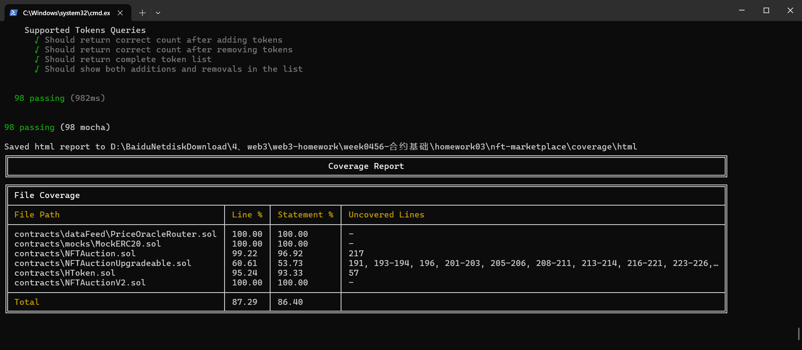


## 9. 部署

### 9.1 代理模式部署

🍊以代理模式在sepolia测试网部署

```typescript

import { network } from "hardhat";
import { developmentNetwork } from "../helper-hardhat-config.js"
import { config } from "@chainlink/env-enc"
config()
import { DECIMAL, INITIAL_ANSWER, networkConfig } from "../helper-hardhat-config.js"

/**
 * 透明代理模式部署
 * npx hardhat run scripts/deployWithProxy.ts --network <network>
 * 
 * ${networkName.toUpperCase()}__PROXY_ADMIN_ADDRESS -- 管理员地址，从环境变量获取
 */
async function main() {
    // 获取ethers对象
    const connection = await network.getOrCreate();
    const { ethers } = connection;

    // 获取当前网络名称
    const args = process.argv;
    const networkIndex = args.indexOf("--network");
    const networkName = (networkIndex !== -1 && args[networkIndex + 1])
        ? args[networkIndex + 1]
        : "hardhat";
    const networkInfo = await ethers.provider.getNetwork();
    const chainId = Number(networkInfo.chainId);

    // 统一的状态变量
    let proxyAdminOwner: any;
    let dataFeedAddr: any; // dataFeed地址，dev为mock的，stg为环境配置
    let feeReceiver: any; // 手续费接收地址

    // 根据网络名称，取不同的admin owner
    if (developmentNetwork.includes(networkName)) {
        // 走开发环境部署，mock一个喂价合约, proxyAdminOwner为account1了默认
        const [deployer, _feeReceiver] = await ethers.getSigners();
        proxyAdminOwner = deployer.address;
        feeReceiver = _feeReceiver.address;
        const mockFactory = await ethers.getContractFactory("MyMockV3Aggregator");
        const deployed = await mockFactory.deploy(DECIMAL, INITIAL_ANSWER);
        await deployed.waitForDeployment();
        dataFeedAddr = await deployed.getAddress();
    } else {// 走测试网部署 
        // 获取配置
        const ownerKey = `${networkName.toUpperCase()}_PROXY_ADMIN_ADDRESS`;
        proxyAdminOwner = process.env[ownerKey];
        const feeReceiverKey = `${networkName.toUpperCase()}_FEE_RECEIVER_ADDRESS`;
        feeReceiver = process.env[feeReceiverKey];

        // eth2USDDataFeed
        dataFeedAddr = networkConfig[chainId].eth2USDDataFeed;
    }
    console.log('networkName: ', networkName, "\nproxyAdminOwner: ", proxyAdminOwner);
    console.log("dataFeedAddr: ", dataFeedAddr);
    console.log("feeReceiver: ", feeReceiver);

    // 管理员地址必须有效
    if (!ethers.isAddress(proxyAdminOwner) || proxyAdminOwner == "" || proxyAdminOwner == ethers.ZeroAddress) {
        throw new Error("没有获取到有效的 proxyAdminOwner");
    }


    // 部署实现合约，同时准备初始化数据，让代理合约通过delegatecall调用logic合约，初始化状态在proxy内部
    console.log("Deploying NFTAuctionUpgradeable...");
    const implementationFactory = await ethers.getContractFactory("NFTAuctionUpgradeable");
    const implementationDeployed = await implementationFactory.deploy();
    await implementationDeployed.waitForDeployment();
    const implementationAddress = await implementationDeployed.getAddress();
    console.log("implementationAddress:", implementationAddress);

    // 准备初始化数据
    const initializeInterface = new ethers.Interface([
        "function initialize(address _feeReceiver,address _dataFeed)"
    ]);
    const initData = initializeInterface.encodeFunctionData("initialize", [
        feeReceiver,
        dataFeedAddr,
    ]);

    // 部署代理合约，并进行初始化操作
    console.log("Deploying TransparentUpgradeableProxy...");
    const TransparentUpgradeableProxy = await ethers.getContractFactory(
        "TransparentUpgradeableProxy"
    );
    const proxy = await TransparentUpgradeableProxy.deploy(
        implementationAddress,
        proxyAdminOwner,
        initData
    );
    await proxy.waitForDeployment();
    const proxyAddress = await proxy.getAddress();

    // 因为代理合约的构造器里面有部署proxyAdmin合约，我们从存储槽读取并验证admin owner
    const ERC1967_ADMIN_STORAGE_SLOT = "0xb53127684a568b3173ae13b9f8a6016e243e63b6e8ee1178d6a717850b5d6103";
    const adminStorage = await ethers.provider.getStorage(
        proxyAddress,
        ERC1967_ADMIN_STORAGE_SLOT
    );
    const adminStorageHex = adminStorage.startsWith("0x") ? adminStorage.slice(2) : adminStorage;
    const actualProxyAdminAddress = ethers.getAddress("0x" + adminStorageHex.slice(-40).padStart(40, '0'));

    const ProxyAdmin = await ethers.getContractFactory("ProxyAdmin");
    const proxyAdmin = ProxyAdmin.attach(actualProxyAdminAddress);
    const actualProxyAdminOwner = await proxyAdmin.owner();
    console.log('actualProxyAdminOwner: ', actualProxyAdminOwner);
    console.log('proxyAdminOwner: ', proxyAdminOwner);

    // 校验proxAdmin合约的admin owner 和 我们配置的proxyAdminOwner是不是同一个
    if (actualProxyAdminOwner.toLowerCase() !== proxyAdminOwner.toLowerCase()) {
        throw new Error(
            `ProxyAdmin 所有者设置失败！期望: ${proxyAdminOwner}, 实际: ${actualProxyAdminOwner}`
        );
    }


    // 验证部署 以NFTAuctionUpgradeable的ABI部署，向proxyAddress地址发交易
    const auction = await ethers.getContractAt("NFTAuctionUpgradeable", proxyAddress);
    const receiver = await auction.feeReceiver();
    const platformFee = await auction.platformFee();

    console.log("\n=== Deployment Summary ===");
    console.log("Proxy Address:", proxyAddress);
    console.log("Implementation Address:", implementationAddress);
    console.log("ProxyAdmin Address:", actualProxyAdminAddress);
    console.log("ProxyAdmin Owner:", proxyAdminOwner);
    console.log("FeeReceiver:", receiver);
    console.log("PlatformFee:", platformFee);
}

main()
    .then(() => {
        console.log("\n✓ Deployment successful");
        console.log("\n⚠️  重要提示：ProxyAdmin 的所有者可以升级代理合约，请确保安全保管私钥！");
        process.exit(0);
    })
    .catch((error) => {
        console.error("\n✗ Deployment failed:");
        console.error(error);
        process.exit(1);
    })
```

部署结果如下

```cmd
PS D:\BaiduNetdiskDownload\4、web3\web3-homework\week0456-合约基础\homework03\nft-marketplace> npx hardhat run .\scripts\deployWithProxy.ts --network sepolia

networkName:  sepolia
proxyAdminOwner:  0x19f2Df197914E06A0ee1F933F24375298F373bAD
dataFeedAddr:  0x694AA1769357215DE4FAC081bf1f309aDC325306
feeReceiver:  0x3AC1Fb4bdc60BF4263D28889770D69877f32A3D2
Deploying NFTAuctionUpgradeable...
implementationAddress: 0xEF2D8FE4CCe6E8f08FfbFeb353618f3AAd7c47e9
Deploying TransparentUpgradeableProxy...
actualProxyAdminOwner:  0x19f2Df197914E06A0ee1F933F24375298F373bAD
proxyAdminOwner:  0x19f2Df197914E06A0ee1F933F24375298F373bAD

=== Deployment Summary ===
Proxy Address: 0xC1f775f067Ce8D125FFEC5c50d3D305b3716326F
Implementation Address: 0xEF2D8FE4CCe6E8f08FfbFeb353618f3AAd7c47e9
ProxyAdmin Address: 0xa02c55DCce869155c6C5D0230f889b409d9AB282
ProxyAdmin Owner: 0x19f2Df197914E06A0ee1F933F24375298F373bAD
FeeReceiver: 0x3AC1Fb4bdc60BF4263D28889770D69877f32A3D2
PlatformFee: 250n

✓ Deployment successful

⚠️  重要提示：ProxyAdmin 的所有者可以升级代理合约，请确保安全保管私钥！
```


### 9.2 准备升级

🍊部署V2版本的合约，看是否升级有效

```typescript
import { network } from "hardhat";

/**
 * 准备升级：验证新版本合约是否可以升级
 * 
 * 此脚本用于在正式升级前验证新版本的合约代码
 * 
 * 使用方法：
 * npx hardhat run scripts/prepareUpgrade.ts --network <network>
 */
async function main() {
    const connection = await network.connect();
    const { ethers } = connection;

    const proxyAddress = "0xC1f775f067Ce8D125FFEC5c50d3D305b3716326F";

    if (!ethers.isAddress(proxyAddress) || proxyAddress == ethers.ZeroAddress) {
        throw new Error("没有获取到有效的 proxyAddress");
    }

    console.log("Preparing upgrade...");
    console.log("Proxy Address:", proxyAddress);

    // 获取当前实现合约地址
    const ERC1967_PROXY_STORAGE_SLOT = "0x360894a13ba1a3210667c828492db98dca3e2076cc3735a920a3ca505d382bbc";
    const currentImplementationAddress = await ethers.provider.getStorage(
        proxyAddress,
        ERC1967_PROXY_STORAGE_SLOT
    );
    const implStorageHex = currentImplementationAddress.startsWith("0x")
        ? currentImplementationAddress.slice(2)
        : currentImplementationAddress;
    const currentImpl = ethers.getAddress("0x" + implStorageHex.slice(-40).padStart(40, '0'));
    console.log("Current Implementation:", currentImpl);

    // 获取 ProxyAdmin 合约地址
    const ERC1967_ADMIN_STORAGE_SLOT = "0xb53127684a568b3173ae13b9f8a6016e243e63b6e8ee1178d6a717850b5d6103";
    const adminStorage = await ethers.provider.getStorage(
        proxyAddress,
        ERC1967_ADMIN_STORAGE_SLOT
    );
    const adminStorageHex = adminStorage.startsWith("0x") ? adminStorage.slice(2) : adminStorage;
    const proxyAdminAddress = ethers.getAddress("0x" + adminStorageHex.slice(-40).padStart(40, '0'));
    console.log("ProxyAdmin Address:", proxyAdminAddress);

    // 部署新版本的实现合约（仅用于验证，不实际升级）
    console.log("\nDeploying new implementation contract...");
    const MultiSigWalletV2 = await ethers.getContractFactory("NFTAuctionV2");
    const newImplementation = await MultiSigWalletV2.deploy();
    await newImplementation.waitForDeployment();
    const newImplementationAddress = await newImplementation.getAddress();
    console.log("New Implementation:", newImplementationAddress);

    // 验证合约可调用
    try {
        const v2Contract = await ethers.getContractAt("NFTAuctionV2", newImplementationAddress);
        await v2Contract.priceOracle();
    } catch (error: any) {
        throw new Error(`New implementation contract verification failed: ${error.message}`);
    }

    console.log("\n=== Preparation Summary ===");
    console.log("New Implementation:", newImplementationAddress);
    console.log("Current Implementation:", currentImpl);
    console.log("ProxyAdmin Address:", proxyAdminAddress);

    return {
        newImplementation: newImplementationAddress,
        currentImplementation: currentImpl,
        proxyAdmin: proxyAdminAddress,
    };
}

main()
    .then(() => {
        console.log("\n✓ Preparation successful");
        process.exit(0);
    })
    .catch((error) => {
        console.error("\n✗ Preparation failed:");
        console.error(error);
        process.exit(1);
    });

```

结果如下

```cmd
PS D:\BaiduNetdiskDownload\4、web3\web3-homework\week0456-合约基础\homework03\nft-marketplace> npx hardhat run .\scripts\prepareUpgrade.ts --network sepolia

Preparing upgrade...
Proxy Address: 0xC1f775f067Ce8D125FFEC5c50d3D305b3716326F
Current Implementation: 0xEF2D8FE4CCe6E8f08FfbFeb353618f3AAd7c47e9
ProxyAdmin Address: 0xa02c55DCce869155c6C5D0230f889b409d9AB282

Deploying new implementation contract...
New Implementation: 0x0E5DcFA7b9101c610f9500aFB5c558e76e34C39a

=== Preparation Summary ===
New Implementation: 0x0E5DcFA7b9101c610f9500aFB5c558e76e34C39a
Current Implementation: 0xEF2D8FE4CCe6E8f08FfbFeb353618f3AAd7c47e9
ProxyAdmin Address: 0xa02c55DCce869155c6C5D0230f889b409d9AB282

✓ Preparation successful
```


### 9.3 实现升级部署

```typescript
import { network } from "hardhat";
import { DECIMAL, INITIAL_ANSWER, networkConfig, developmentNetwork } from "../helper-hardhat-config.js"

/**
 * 真正的升级合约，将proxy合约的imple指向新的logic地址
 * 
 * 使用方法：
 * npx hardhat run scripts/upgrade.ts --network <network>
 * 
 * 环境变量配置：
 * - PROXY_ADDRESS: 代理合约地址（必需）
 * - {NETWORK}_PROXY_ADMIN_OWNER: ProxyAdmin 的所有者地址（可选，用于验证）
 * 
 * 示例：
 * npx hardhat run scripts/upgrade.ts --network sepolia
 */
async function main() {
    // 获取ethers对象
    const connection = await network.getOrCreate();
    const { ethers } = connection;

    // 获取当前网络名称
    const args = process.argv;
    const networkIndex = args.indexOf("--network");
    const networkName = (networkIndex !== -1 && args[networkIndex + 1])
        ? args[networkIndex + 1]
        : "hardhat";
    const networkInfo = await ethers.provider.getNetwork();
    const chainId = Number(networkInfo.chainId);
    const [deployer] = await ethers.getSigners();

    // 初始化变量
    let proxyAddress: any;
    let dataFeedAddr: any;
    if (developmentNetwork.includes(networkName)) {
        proxyAddress = deployer.address;
        const mockFactory = await ethers.getContractFactory("MyMockV3Aggregator");
        const deployed = await mockFactory.deploy(DECIMAL, INITIAL_ANSWER);
        await deployed.waitForDeployment();
        dataFeedAddr = await deployed.getAddress();
    } else {
        const addrKey = `${networkName.toUpperCase()}_PROXY_ADDRESS`;
        proxyAddress = process.env[addrKey];
        dataFeedAddr = networkConfig[chainId].eth2USDDataFeed;
    }
    if (!ethers.isAddress(proxyAddress) || proxyAddress == "" || proxyAddress == ethers.ZeroAddress) {
        throw new Error("Invalid proxyAddress");
    }


    console.log("Upgrading NFTAuction...");
    console.log(`Network: ${networkName} (Chain ID: ${chainId})`);
    console.log("Deployer:", deployer.address);
    console.log("Proxy Address:", proxyAddress);

    // 获取当前实现合约地址
    const ERC1967_PROXY_STORAGE_SLOT = "0x360894a13ba1a3210667c828492db98dca3e2076cc3735a920a3ca505d382bbc";
    const currentImplementationStorage = await ethers.provider.getStorage(
        proxyAddress,
        ERC1967_PROXY_STORAGE_SLOT
    );
    const implStorageHex = currentImplementationStorage.startsWith("0x")
        ? currentImplementationStorage.slice(2)
        : currentImplementationStorage;
    const currentImpl = ethers.getAddress("0x" + implStorageHex.slice(-40).padStart(40, '0'));
    console.log("Current Implementation:", currentImpl);

    // 获取 ProxyAdmin 合约地址
    const ERC1967_ADMIN_STORAGE_SLOT = "0xb53127684a568b3173ae13b9f8a6016e243e63b6e8ee1178d6a717850b5d6103";
    const adminStorage = await ethers.provider.getStorage(
        proxyAddress,
        ERC1967_ADMIN_STORAGE_SLOT
    );
    const adminStorageHex = adminStorage.startsWith("0x") ? adminStorage.slice(2) : adminStorage;
    const proxyAdminAddress = ethers.getAddress("0x" + adminStorageHex.slice(-40).padStart(40, '0'));
    console.log("ProxyAdmin Address:", proxyAdminAddress);

    // 步骤 1: 部署新版本的实现合约
    console.log("\n[1/4] Deploying new implementation contract...");
    const NFTAuctionV2 = await ethers.getContractFactory("NFTAuctionV2");
    const newImplementation = await NFTAuctionV2.deploy();
    await newImplementation.waitForDeployment();
    const newImplementationAddress = await newImplementation.getAddress();
    console.log("New Implementation:", newImplementationAddress);

    // 新合约参数初始化
    const routerFactory = await ethers.getContractFactory("PriceOracleRouter");
    const routerFactoryDeployed = await routerFactory.deploy(dataFeedAddr, DECIMAL);
    await routerFactoryDeployed.waitForDeployment();
    const routerAddress = await routerFactoryDeployed.getAddress();
    console.log('routerAddress: ', routerAddress);

    const initializeInterface = new ethers.Interface([
        "function initializeV2(address _priceOracle, uint256 _version)"
    ]);
    const initData = initializeInterface.encodeFunctionData("initializeV2", [routerAddress, 2]);

    // 步骤 2: 验证 ProxyAdmin 所有者
    console.log("\n[2/4] Verifying ProxyAdmin owner...");
    const ProxyAdmin = await ethers.getContractFactory("ProxyAdmin");
    const proxyAdmin = ProxyAdmin.attach(proxyAdminAddress);
    const adminOwner = await proxyAdmin.owner();
    console.log("ProxyAdmin Owner:", adminOwner);

    // 验证所有者地址不是 ProxyAdmin 地址本身
    if (adminOwner.toLowerCase() === proxyAdminAddress.toLowerCase()) {
        throw new Error(
            `ProxyAdmin 的所有者地址与 ProxyAdmin 地址相同，这是不正确的配置。`
        );
    }

    // 从环境变量获取期望的 ProxyAdmin 所有者（如果配置了）
    const expectedOwnerEnvKey = `${networkName.toUpperCase()}_PROXY_ADMIN_ADDRESS`;
    const expectedOwnerFromEnv = process.env[expectedOwnerEnvKey];

    if (expectedOwnerFromEnv) {
        const expectedOwner = ethers.getAddress(expectedOwnerFromEnv);
        if (expectedOwner.toLowerCase() !== adminOwner.toLowerCase()) {
            throw new Error(
                `环境变量配置的 ProxyAdmin 所有者 (${expectedOwner}) 与链上的实际所有者 (${adminOwner}) 不匹配。`
            );
        }
    }

    // 检查部署者是否是 ProxyAdmin 的所有者  部署者应该是admin的owner，才有权利升级合约
    if (adminOwner.toLowerCase() !== deployer.address.toLowerCase()) {
        throw new Error(
            `Deployer (${deployer.address}) is not the owner of ProxyAdmin (${adminOwner}). ` +
            `请使用地址 ${adminOwner} 对应的私钥配置 ${networkName.toUpperCase()}_PRIVATE_KEY`
        );
    }

    // 步骤 3: 执行升级
    console.log("\n[3/4] Executing upgrade...");
    const upgradeTx = await proxyAdmin.upgradeAndCall(
        proxyAddress,
        newImplementationAddress,
        initData
    );
    console.log("Transaction hash:", upgradeTx.hash);
    await upgradeTx.wait();
    console.log("✓ Upgrade transaction confirmed");

    // 验证新实现地址
    const newImplStorage = await ethers.provider.getStorage(
        proxyAddress,
        ERC1967_PROXY_STORAGE_SLOT
    );
    const newImplStorageHex = newImplStorage.startsWith("0x")
        ? newImplStorage.slice(2)
        : newImplStorage;
    const verifiedNewImpl = ethers.getAddress("0x" + newImplStorageHex.slice(-40).padStart(40, '0'));
    if (verifiedNewImpl.toLowerCase() !== newImplementationAddress.toLowerCase()) {
        throw new Error(
            `升级验证失败：实现地址不匹配。期望: ${newImplementationAddress}, 实际: ${verifiedNewImpl}`
        );
    }

    // 步骤 4: 初始化 V2 功能并验证
    console.log("\n[4/4] Initializing V2 features and verifying...");
    const auction = await ethers.getContractAt("NFTAuctionV2", proxyAddress);
    try {
        await auction.priceOracle();
    } catch (error: any) {
        throw new Error(`Contract V2 verification failed: ${error.message}`);
    }

    // 最终验证
    const finalVersion = await auction.version();
    const platformFee = await auction.platformFee();
    const feeReceiver = await auction.feeReceiver();

    console.log("\n=== Upgrade Summary ===");
    console.log("Proxy Address:", proxyAddress);
    console.log("New Implementation:", newImplementationAddress);
    console.log("Version:", finalVersion.toString());
    console.log("feeReceiver:", feeReceiver);
    console.log("platformFee:", platformFee);

    return {
        proxy: proxyAddress,
        implementation: newImplementationAddress,
        version: finalVersion.toString(),
    };
}

main()
    .then(() => {
        console.log("\n✓ Upgrade successful");
        process.exit(0);
    })
    .catch((error) => {
        console.error("\n✗ Upgrade failed:");
        console.error(error);
        process.exit(1);
    });

```

升级成功

```cmd
PS D:\BaiduNetdiskDownload\4、web3\web3-homework\week0456-合约基础\homework03\nft-marketplace> npx hardhat run .\scripts\upgrade.ts --network sepolia

Upgrading NFTAuction...
Network: sepolia (Chain ID: 11155111)
Deployer: 0x19f2Df197914E06A0ee1F933F24375298F373bAD
Proxy Address: 0xC1f775f067Ce8D125FFEC5c50d3D305b3716326F
Current Implementation: 0xEF2D8FE4CCe6E8f08FfbFeb353618f3AAd7c47e9
ProxyAdmin Address: 0xa02c55DCce869155c6C5D0230f889b409d9AB282

[1/4] Deploying new implementation contract...
New Implementation: 0x86757Fc97F2deAB6851d045c2fca4529d2a351b5
routerAddress:  0xBe0D6cd0b5725018cFcB49d418FEB196caC187ab

[2/4] Verifying ProxyAdmin owner...
ProxyAdmin Owner: 0x19f2Df197914E06A0ee1F933F24375298F373bAD

[3/4] Executing upgrade...
Transaction hash: 0xb9d66cf2e177463eeb10eec6a1821d2386d31d1dbe44bfb273c4db406e2492b6
✓ Upgrade transaction confirmed

[4/4] Initializing V2 features and verifying...

=== Upgrade Summary ===
Proxy Address: 0xC1f775f067Ce8D125FFEC5c50d3D305b3716326F
New Implementation: 0x86757Fc97F2deAB6851d045c2fca4529d2a351b5
Version: 2
feeReceiver: 0x3AC1Fb4bdc60BF4263D28889770D69877f32A3D2
platformFee: 250n

✓ Upgrade successful
```


## 10. 遇到的问题

⭐️测试代码中，在expect前，一定要await，不然很容易造成状态错乱，并行执行了

```typescript
    /**
     * module2----> 测试ETH出价
     */
    describe("PlaceBid", async function () {
        let htoken: any;
        let nftAuction: any;
        let seller: any;
        let buyer: any;
        let account1: any, account2: any, account3: any, account4: any, account5: any;
        beforeEach(async function () {
            // 解构变量，提升作用域
            ({ account1, account2, account3, account4, account5, nftAuction, htoken }
                = await connection.networkHelpers.loadFixture(deployHTOKENFixture));

            // 创建拍卖活动
            await htoken.connect(account1).safeMint(account2, { value: ethers.parseEther("0.01") }); // mint
            await htoken.connect(account2).approve(nftAuction.getAddress(), 0); // approved
            seller = nftAuction.connect(account2);
            await seller.createAuction(htoken.getAddress(), 0, 5, 2)
            buyer = nftAuction.connect(account3);
        })

        // 当前排名活动必须是active状态，才能进行出价
        it("Should auction is active", async function () {
            // 设置成false
            await seller.setAuctionStatus(1, false);
            await expect(buyer.placeBid(1)).to.be.revertedWith("Auction is not active");
        })

        // 当前时间必须没有结束，才能进行出价
        it("Should placedBid must be time is not over", async function () {
            // 获取拍卖合约中的拍卖对象
            const auction = await nftAuction.acutionMaps(1);
            // 将区块链时间推进到超过指定截止时间
            await advanceTimePastDeadline(auction.endTime);
            // 再来调用出价函数
            await expect(buyer.placeBid(1)).to.be.revertedWith("Auction is end");
        })

        // seller不能自己给自己出价
        it("Should reject if seller placeBid to himself", async function () {
            await expect(seller.placeBid(1)).to.be.revertedWith("You can not placeBid by yourself");
        })

        
    });
```


⭐️使用let声明的变量，如果是先声明，后赋值的，解构的时候，要加圆括号

```typescript
// ✅ 声明时直接解构，不需要括号
const { a, b } = obj;
let { a, b } = obj;

// ✅ 函数参数解构，不需要括号
function fn({ a, b }) {}

// ✅ 返回值解构，不需要括号
const { a, b } = await someAsync();

// ❌ 先声明后赋值，需要括号
let a, b;
({ a, b } = obj);
```


⭐️出价函数中，更新最高出价的时候，应该给买家实际出的值`msg.value` ，而不是minPrice

```typescript
// ETH出价, 需要支付足够的ETH，出价必须高于当前最高出价的5%
function placeBid(uint256 auctionId) external payable {
    。。。
    // 计算最低出价
    uint256 minPrice;
    if (auction.highestBid == 0) {
        // 如果没有出价，那么此时就是起拍价
        minPrice = auction.startPrice;
    } else {
        minPrice = auction.highestBid + ((auction.highestBid * 5) / 100);
    }

	。。。
    // 更新出价
    auction.highestBid = msg.value; // 这里应该给买家出的实际值，不然多的钱会被锁在合约里面
	。。。
}
```


⭐️在出价、结束拍卖，只要是涉及Auction对象修改的，都应该声明为storage的，要不然修改不生效

```typescript
// 拍卖结束，到点了，结束拍卖，以最高价为准，转移NFT，计算手续费，转钱给卖家
function endAuction(uint256 index) external nonReentrant {
    Auction storage auction = acutionMaps[index];
    。。。
    
// ETH出价, 需要支付足够的ETH，出价必须高于当前最高出价的5%
function placeBid(uint256 auctionId) external payable {
    Auction storage auction = acutionMaps[auctionId];
    。。。
```


⭐️pendingRefundMap 是 mapping(uint256 => mapping(address => uint256))，Solidity 自动生成的 getter 需要两个参数一起传：

```solidity
const refund = await nftAuction.pendingRefundMap(1, account1.address);
```


⭐️hardhatV3中，查看测试覆盖率报告的命令从V2版本的task，移动到了global option中

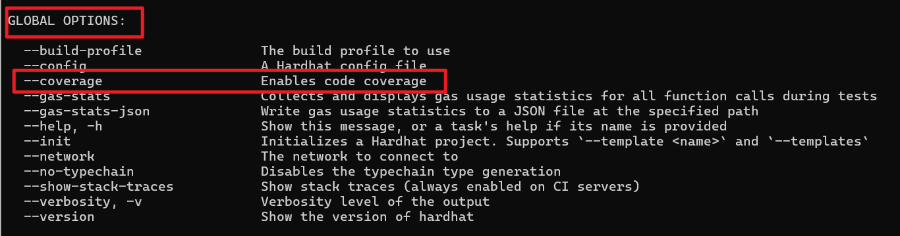 


# 二、整体架构图

## 1. 合约架构与依赖关系

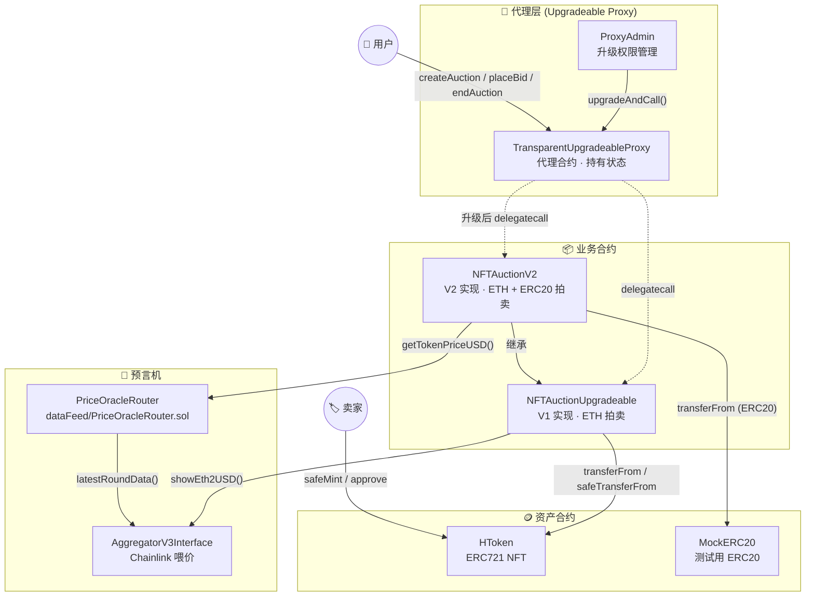
```mermaid
graph TB
    subgraph 代理层["🔧 代理层 (Upgradeable Proxy)"]
        PA[ProxyAdmin<br/>升级权限管理]
        TUP[TransparentUpgradeableProxy<br/>代理合约 · 持有状态]
    end

    subgraph 业务层["📦 业务合约"]
        V1[NFTAuctionUpgradeable<br/>V1 实现 · ETH 拍卖]
        V2[NFTAuctionV2<br/>V2 实现 · ETH + ERC20 拍卖]
    end

    subgraph 资产层["🪙 资产合约"]
        HT[HToken<br/>ERC721 NFT]
        ERC20[MockERC20<br/>测试用 ERC20]
    end

    subgraph 预言机["📡 预言机"]
        POR[PriceOracleRouter<br/>dataFeed/PriceOracleRouter.sol]
        CL[AggregatorV3Interface<br/>Chainlink 喂价]
    end

    PA -->|"upgradeAndCall()"| TUP
    TUP -.->|"delegatecall"| V1
    TUP -.->|"升级后 delegatecall"| V2
    V2 -->|"继承"| V1

    V1 -->|"transferFrom / safeTransferFrom"| HT
    V2 -->|"transferFrom (ERC20)"| ERC20
    V2 -->|"getTokenPriceUSD()"| POR
    V1 -->|"showEth2USD()"| CL
    POR -->|"latestRoundData()"| CL

    User((👤 用户)) -->|"createAuction / placeBid / endAuction"| TUP
    Seller((🏷️ 卖家)) -->|"safeMint / approve"| HT

```


## 2. 拍卖完整生命周期（ETH出价）

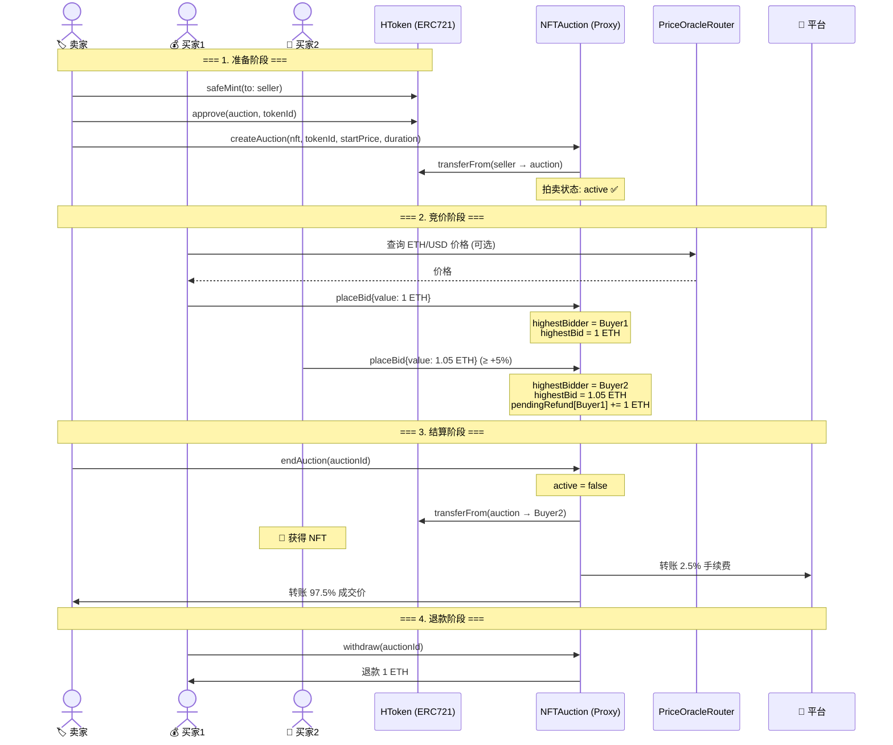
```mermaid
sequenceDiagram
    actor Seller as 🏷️ 卖家
    actor Buyer1 as 💰 买家1
    actor Buyer2 as 💸 买家2
    participant HToken as HToken (ERC721)
    participant Auction as NFTAuction (Proxy)
    participant Oracle as PriceOracleRouter
    participant Platform as 🏦 平台

    Note over Seller, HToken: === 1. 准备阶段 ===
    Seller->>HToken: safeMint(to: seller)
    Seller->>HToken: approve(auction, tokenId)
    Seller->>Auction: createAuction(nft, tokenId, startPrice, duration)
    Auction->>HToken: transferFrom(seller → auction)
    Note over Auction: 拍卖状态: active ✅

    Note over Seller, Platform: === 2. 竞价阶段 ===
    Buyer1->>Oracle: 查询 ETH/USD 价格 (可选)
    Oracle-->>Buyer1: 价格
    Buyer1->>Auction: placeBid{value: 1 ETH}
    Note over Auction: highestBidder = Buyer1<br/>highestBid = 1 ETH

    Buyer2->>Auction: placeBid{value: 1.05 ETH} (≥ +5%)
    Note over Auction: highestBidder = Buyer2<br/>highestBid = 1.05 ETH<br/>pendingRefund[Buyer1] += 1 ETH

    Note over Seller, Platform: === 3. 结算阶段 ===
    Seller->>Auction: endAuction(auctionId)
    Note over Auction: active = false

    Auction->>HToken: transferFrom(auction → Buyer2)
    Note over Buyer2: 🎉 获得 NFT

    Auction->>Platform: 转账 2.5% 手续费
    Auction->>Seller: 转账 97.5% 成交价

    Note over Seller, Platform: === 4. 退款阶段 ===
    Buyer1->>Auction: withdraw(auctionId)
    Auction->>Buyer1: 退款 1 ETH

```


## 3. ERC20 出价流程（V2）

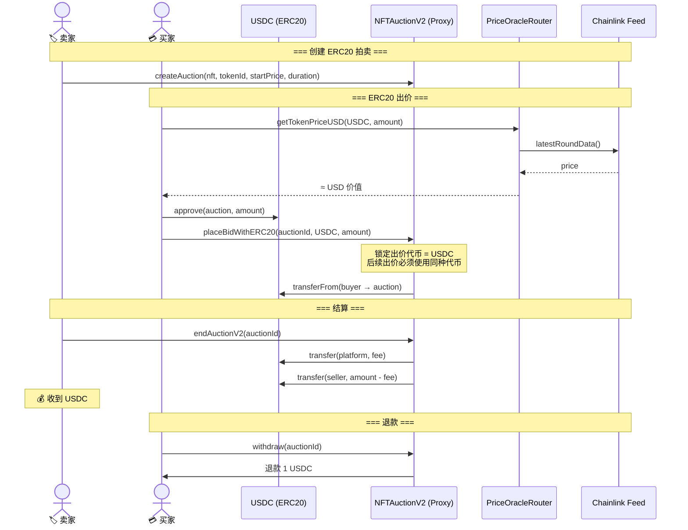
```mermaid
sequenceDiagram
    actor Seller as 🏷️ 卖家
    actor Buyer as 💳 买家
    participant USDC as USDC (ERC20)
    participant Auction as NFTAuctionV2 (Proxy)
    participant Oracle as PriceOracleRouter
    participant Chainlink as Chainlink Feed

    Note over Seller, Chainlink: === 创建 ERC20 拍卖 ===
    Seller->>Auction: createAuction(nft, tokenId, startPrice, duration)

    Note over Buyer, Chainlink: === ERC20 出价 ===
    Buyer->>Oracle: getTokenPriceUSD(USDC, amount)
    Oracle->>Chainlink: latestRoundData()
    Chainlink-->>Oracle: price
    Oracle-->>Buyer: ≈ USD 价值

    Buyer->>USDC: approve(auction, amount)
    Buyer->>Auction: placeBidWithERC20(auctionId, USDC, amount)
    Note over Auction: 锁定出价代币 = USDC<br/>后续出价必须使用同种代币
    Auction->>USDC: transferFrom(buyer → auction)

    Note over Seller, Chainlink: === 结算 ===
    Seller->>Auction: endAuctionV2(auctionId)
    Auction->>USDC: transfer(platform, fee)
    Auction->>USDC: transfer(seller, amount - fee)
    Note over Seller: 💰 收到 USDC
    
    Note over Buyer, Chainlink: === 退款 ===
    Buyer->>Auction: withdraw(auctionId)
    Auction->>Buyer: 退款 1 USDC

```


## 4. 合约升级流程（V1 → V2）

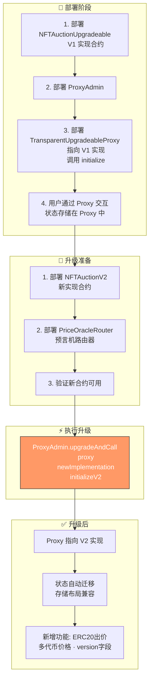
```mermaid
graph TD
    subgraph 部署["🚀 部署阶段"]
        A1["1. 部署 NFTAuctionUpgradeable
            V1 实现合约"]
        A2["2. 部署 ProxyAdmin"]
        A3["3. 部署 TransparentUpgradeableProxy
            指向 V1 实现
            调用 initialize"]
        A4["4. 用户通过 Proxy 交互
            状态存储在 Proxy 中"]
    end

    subgraph 准备["🔧 升级准备"]
        B1["1. 部署 NFTAuctionV2
            新实现合约"]
        B2["2. 部署 PriceOracleRouter
            预言机路由器"]
        B3["3. 验证新合约可用"]
    end

    subgraph 执行["⚡ 执行升级"]
        C1["ProxyAdmin.upgradeAndCall
            proxy
            newImplementation
            initializeV2"]
    end

    subgraph 完成["✅ 升级后"]
        D1["Proxy 指向 V2 实现"]
        D2["状态自动迁移
            存储布局兼容"]
        D3["新增功能: ERC20出价
            多代币价格 · version字段"]
    end

    A1 --> A2 --> A3 --> A4
    A4 --> B1 --> B2 --> B3
    B3 --> C1
    C1 --> D1 --> D2 --> D3

    style C1 fill:#f96,stroke:#333,color:#fff

```


## 5. 资金流向汇总


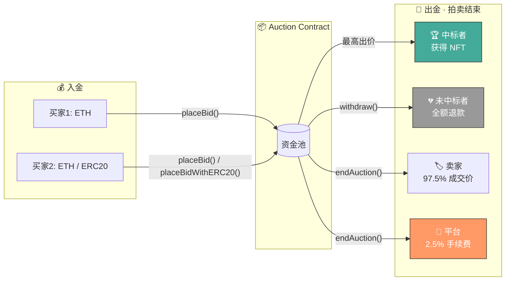
```mermaid
flowchart LR
    subgraph 入金["💰 入金"]
        B1[买家1: ETH]
        B2[买家2: ETH / ERC20]
    end

    subgraph 拍卖合约["📦 Auction Contract"]
        Pool[(资金池)]
    end

    subgraph 出金["💸 出金 · 拍卖结束"]
        Winner[🏆 中标者<br/>获得 NFT]
        Loser[💔 未中标者<br/>全额退款]
        Seller[🏷️ 卖家<br/>97.5% 成交价]
        Platform[🏦 平台<br/>2.5% 手续费]
    end

    B1 -->|"placeBid()"| Pool
    B2 -->|"placeBid() / placeBidWithERC20()"| Pool

    Pool -->|"最高出价"| Winner
    Pool -->|"withdraw()"| Loser
    Pool -->|"endAuction()"| Seller
    Pool -->|"endAuction()"| Platform

    style Winner fill:#4a9,stroke:#333,color:#fff
    style Platform fill:#f96,stroke:#333,color:#fff
    style Loser fill:#999,stroke:#333,color:#fff

```

