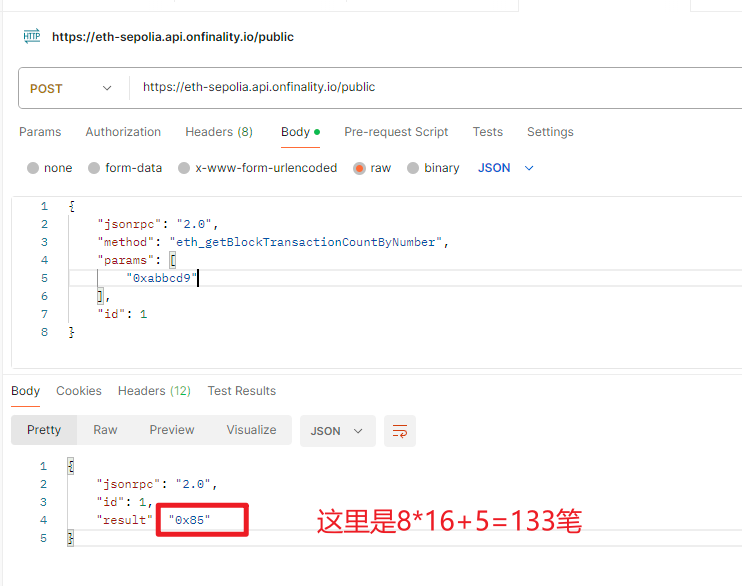
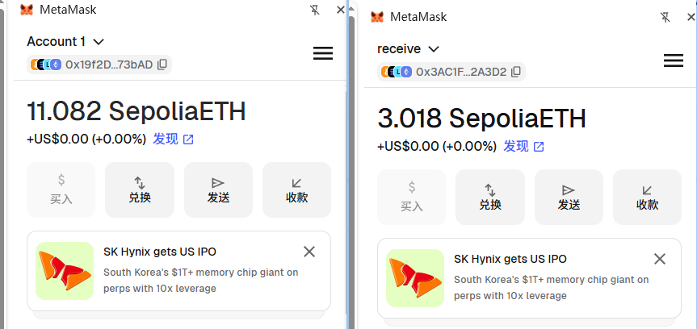
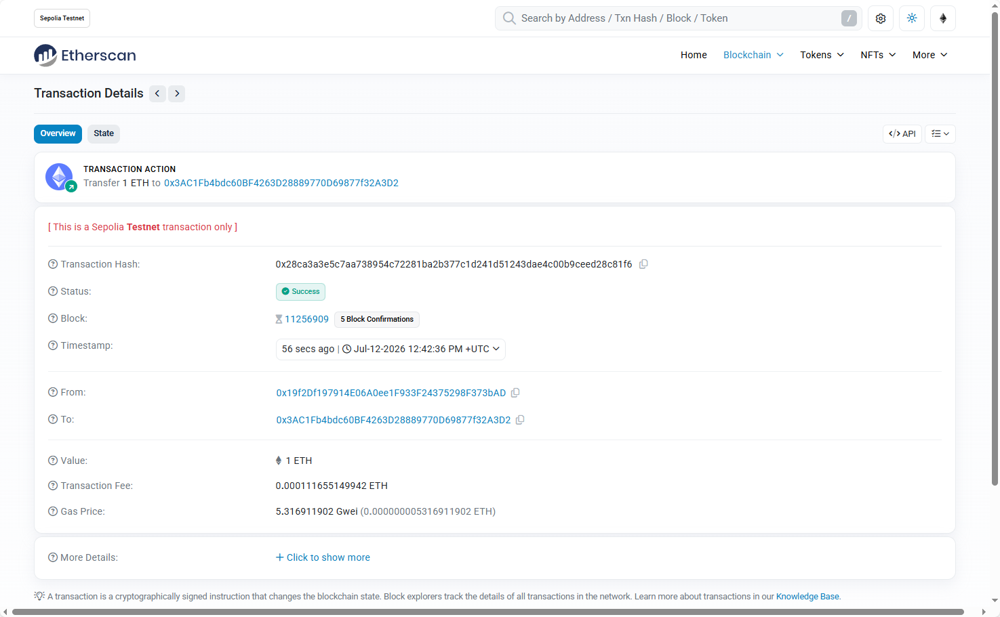

# 一、查询指定区块号信息输出到控制台

```go
package main

import (
	"context"
	"fmt"
	"github.com/ethereum/go-ethereum/ethclient"
	"log"
	"math/big"
	"os"
	"time"
)

// 使用etherClient.Client连接节点
func connectNode() {
	rpcURL := os.Getenv("ETH_RPC_URL")
	if rpcURL == "" {
		log.Fatal("ETH_RPC_URL is not set")
	}

	ctx, cancel := context.WithTimeout(context.Background(), 10*time.Second)
	defer cancel()

	client, err := ethclient.DialContext(ctx, rpcURL)

	if err != nil {
		log.Fatal("出现错误")
	}
	defer client.Close()

	// 真正发送请求：获取最新区块号
	// 如果 endpoint 被 disable 了，这里就会报错
	blockNumber, err := client.BlockNumber(ctx)
	if err != nil {
		log.Fatal("fail to get blockNumber:", err)
	}

	// chainID
	chainId, err := client.ChainID(ctx)
	if err != nil {
		log.Fatal("fail to get chainId:", err)
	}

	// blockInfo
	num := big.NewInt(11255001)
	blockInfo, err := client.BlockByNumber(ctx, num)
	if err != nil {
		log.Fatal("fail to get blockInfo:", err)
	}

	// 获取某个区块下的交易数量
	txCount, err := client.TransactionCount(ctx, blockInfo.Hash())
	if err != nil {
		log.Fatal("fail to get txCount:", err)
	}

	fmt.Printf("连接成功！最新区块号: %d\n", blockNumber)
	fmt.Printf("当前区块号: %d\n", blockInfo.Number().Uint64())
	fmt.Printf("chainId: %d\n", chainId)
	fmt.Printf("blockInfo TxHash: %s\n", blockInfo.Header().TxHash)
	fmt.Printf("blockInfo hash: %s\n", blockInfo.Hash().Hex())
	fmt.Printf("blockInfo Header().Time: %d\n", blockInfo.Header().Time)
	fmt.Printf("blockInfo txCount: %d\n", txCount)

}

func main() {
	connectNode()
}

```

输出如下，指定sepolia的11255001区块信心查看

```cmd
PS D:\BaiduNetdiskDownload\4、web3\web3-homework\week07-go_ethereum\homework\hm01> go run .\01-区块链读写.go
连接成功！最新区块号: 11255380
当前区块号: 11255001
chainId: 11155111
blockInfo TxHash: 0x2ff60e21e7dbabda27e7a1d6cb3aeeaf42e3289c8749fea2e35ccc6bb4a0599c
blockInfo hash: 0xf798e3d666113486a4dba38415a68410b735de02c2c60cafa503778c3f436104
blockInfo Header().Time: 1783835844
blockInfo txCount: 133
```

用postman验证结果，也是133笔交易

 


# 二、给账户发送一个ETH

```go
package main

import (
    "context"
    "crypto/ecdsa"
    "fmt"
    "github.com/ethereum/go-ethereum/common"
    "github.com/ethereum/go-ethereum/core/types"
    "github.com/ethereum/go-ethereum/crypto"
    "github.com/ethereum/go-ethereum/ethclient"
    "log"
    "math/big"
    "os"
    "time"
)

func sendTx(toAddrHex string, amount float64) {
    // 获取rpc和私钥
    rpcURL := os.Getenv("ETH_RPC_URL")
    if rpcURL == "" {
       log.Fatal("ETH_RPC_URL is not set")
    }
    privateKeyHash := os.Getenv("SENDER_PRIVATE_KEY")
    if privateKeyHash == "" {
       log.Fatal("SENDER_PRIVATE_KEY is not set (required for send mode)")
    }

    // 初始化客户端
    ctx, cancel := context.WithTimeout(context.Background(), 30*time.Second)
    defer cancel()

    client, err := ethclient.DialContext(ctx, rpcURL)
    if err != nil {
       log.Fatalf("failed to connect to Ethereum node: %v", err)
    }
    defer client.Close()

    // 解析私钥
    privKey, err := crypto.HexToECDSA(trim0x(privateKeyHash))
    if err != nil {
       log.Fatalf("invalid private key: %v", err)
    }

    // 获取发送方地址
    publicKey := privKey.Public()
    publicKeyECDSA, ok := publicKey.(*ecdsa.PublicKey)
    if !ok {
       log.Fatal("error casting public key to ECDSA")
    }
    fromAddr := crypto.PubkeyToAddress(*publicKeyECDSA)
    toAddr := common.HexToAddress(toAddrHex)

    // 获取链 ID
    chainID, err := client.ChainID(ctx)
    if err != nil {
       log.Fatalf("failed to get chain id: %v", err)
    }

    // 获取 nonce
    nonce, err := client.PendingNonceAt(ctx, fromAddr)
    if err != nil {
       log.Fatalf("failed to get nonce: %v", err)
    }

    // 获取建议的 Gas 价格（使用 EIP-1559 动态费用）
    gasTipCap, err := client.SuggestGasTipCap(ctx)
    if err != nil {
       log.Fatalf("failed to get gas tip cap: %v", err)
    }

    // 获取 base fee，计算 fee cap
    header, err := client.HeaderByNumber(ctx, nil)
    if err != nil {
       log.Fatalf("failed to get header: %v", err)
    }
    baseFee := header.BaseFee
    if baseFee == nil {
       // 如果不支持 EIP-1559，使用传统 gas price
       gasPrice, err := client.SuggestGasPrice(ctx)
       if err != nil {
          log.Fatalf("failed to get gas price: %v", err)
       }
       baseFee = gasPrice
    }

    // fee cap = base fee * 2 + tip cap（简单策略）
    gasFeeCap := new(big.Int).Add(
       new(big.Int).Mul(baseFee, big.NewInt(2)),
       gasTipCap,
    )

    // 估算 Gas Limit（普通转账固定为 21000）
    gasLimit := uint64(21000)

    // 转换 ETH 金额为 Wei
    // amountEth * 1e18
    amountWei := new(big.Float).Mul(
       big.NewFloat(amount),
       big.NewFloat(1e18),
    )
    valueWei, _ := amountWei.Int(nil)

    // 计算总费用：value + gasFeeCap * gasLimit
    totalCost := new(big.Int).Add(
       valueWei,
       new(big.Int).Mul(gasFeeCap, big.NewInt(int64(gasLimit))),
    )

    // 检查余额是否足够
    balance, err := client.BalanceAt(ctx, fromAddr, nil)
    if err != nil {
       log.Fatalf("failed to get balance: %v", err)
    }
    if balance.Cmp(totalCost) < 0 {
       log.Fatalf("insufficient balance: have %s wei, need %s wei", balance.String(), totalCost.String())
    }

    // 构造交易（EIP-1559 动态费用交易）
    txData := &types.DynamicFeeTx{
       ChainID:   chainID,
       Nonce:     nonce,
       GasTipCap: gasTipCap,
       GasFeeCap: gasFeeCap,
       Gas:       gasLimit,
       To:        &toAddr,
       Value:     valueWei,
       Data:      nil,
    }
    tx := types.NewTx(txData)

    // 签名交易
    signer := types.NewLondonSigner(chainID)
    signedTx, err := types.SignTx(tx, signer, privKey)
    if err != nil {
       log.Fatalf("failed to sign transaction: %v", err)
    }

    // 发送交易
    if err := client.SendTransaction(ctx, signedTx); err != nil {
       log.Fatalf("failed to send transaction: %v", err)
    }

    // 输出交易信息
    fmt.Println("=== Transaction Sent ===")
    fmt.Printf("From       : %s\n", fromAddr.Hex())
    fmt.Printf("To         : %s\n", toAddr.Hex())
    fmt.Printf("Value      : %s ETH (%s Wei)\n", fmt.Sprintf("%.6f", amount), valueWei.String())
    fmt.Printf("Gas Limit  : %d\n", gasLimit)
    fmt.Printf("Gas Tip Cap: %s Wei\n", gasTipCap.String())
    fmt.Printf("Gas Fee Cap: %s Wei\n", gasFeeCap.String())
    fmt.Printf("Nonce      : %d\n", nonce)
    fmt.Printf("Tx Hash    : %s\n", signedTx.Hash().Hex())
}

// trim0x 移除十六进制字符串前缀 "0x"
func trim0x(s string) string {
    if len(s) >= 2 && s[:2] == "0x" {
       return s[2:]
    }
    return s
}

func main() {
    const toAddr string = "0x3AC1Fb4bdc60BF4263D28889770D69877f32A3D2"
    sendTx(toAddr, 1)
}
```

发送前的账户余额情况，左边是1号账户，为from，右边是2号账户，为receive方

 

执行发送交易

```cmd
PS D:\BaiduNetdiskDownload\4、web3\web3-homework\week07-go_ethereum\homework\hm01> go run .\03-发送交易.go
=== Transaction Sent ===
From       : 0x19f2Df197914E06A0ee1F933F24375298F373bAD
To         : 0x3AC1Fb4bdc60BF4263D28889770D69877f32A3D2
Value      : 1.000000 ETH (1000000000000000000 Wei)
Gas Limit  : 21000
Gas Tip Cap: 1000000 Wei
Gas Fee Cap: 10715507748 Wei
Nonce      : 75
Tx Hash    : 0x28ca3a3e5c7aa738954c72281ba2b377c1d241d51243dae4c00b9ceed28c81f6
```

再来查看账户余额

 

查看区块浏览器

 


