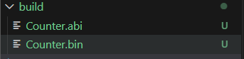
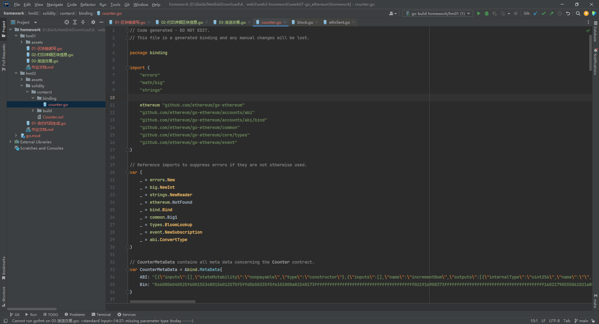
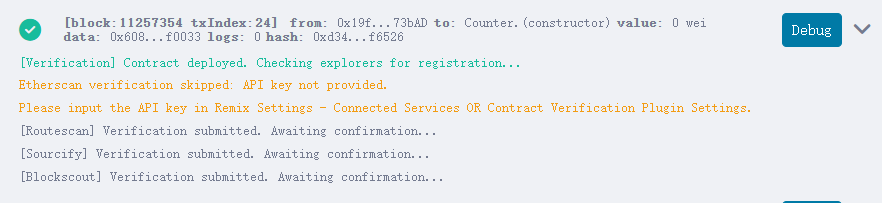
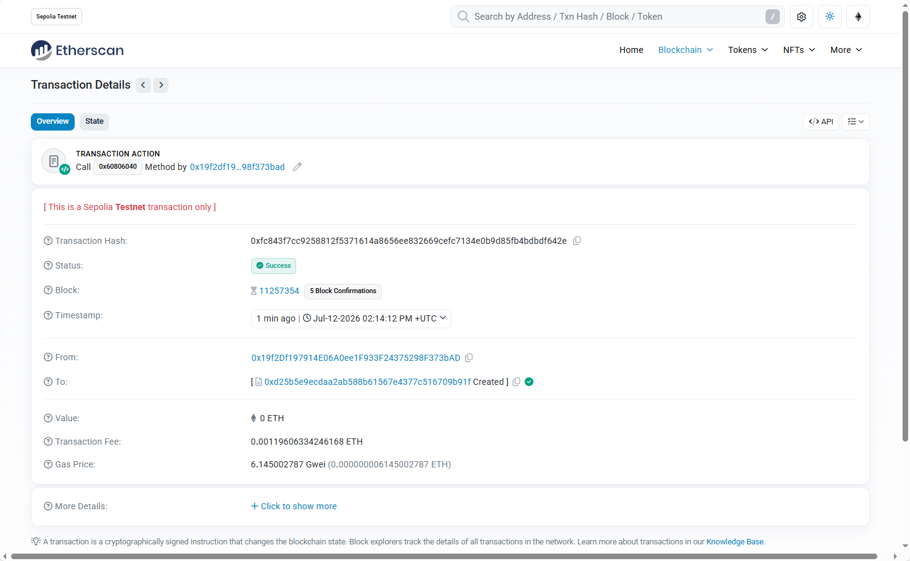
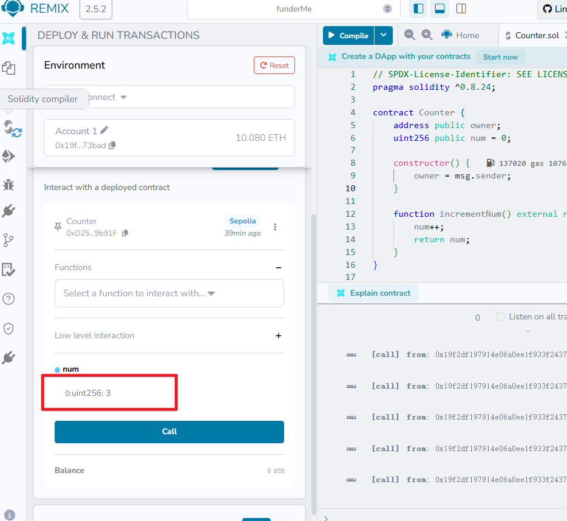
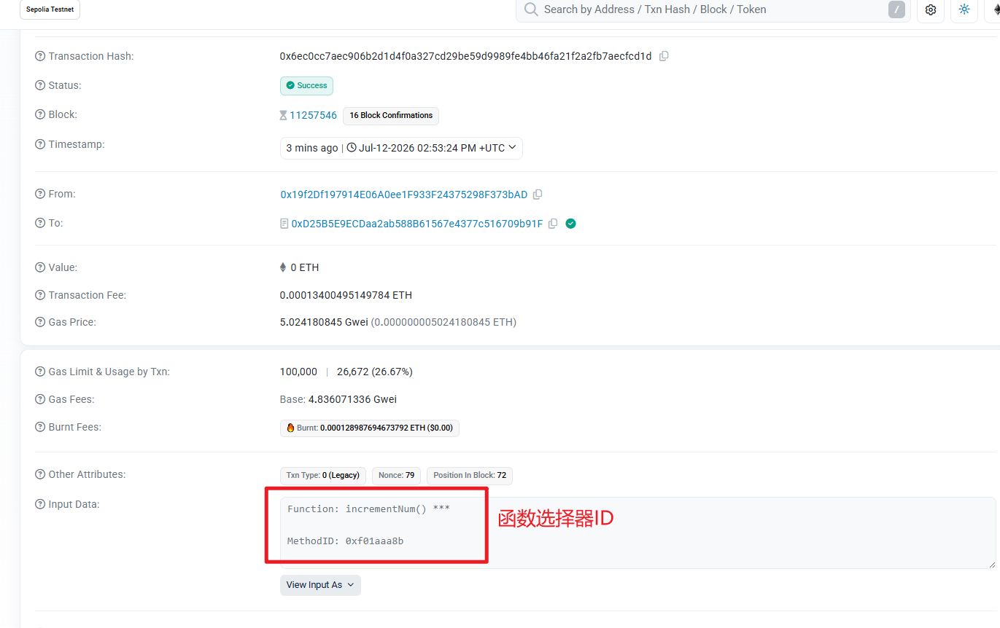
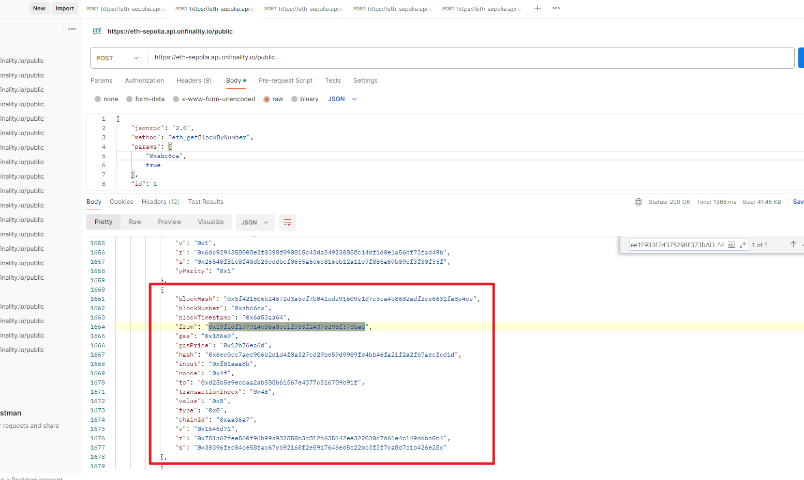

# 一、abigen 生成 Go 绑定代码

## 1. 下载工具

先下载安装包

```cmd
go install github.com/ethereum/go-ethereum/cmd/abigen@latest
```


## 2. 编写一个计数器合约

```solidity
// SPDX-License-Identifier: SEE LICENSE IN LICENSE
pragma solidity ^0.8.24;

contract Counter {
    address public owner;
    uint256 public num = 0;

    constructor() {
        owner = msg.sender;
    }

    function incrementNum() external returns (uint256) {
        num++;
        return num;
    }
}

```


## 3. 拿到合约abi和bin文件

下载solc编译器，配置环境变量，使用以下命令编译拿到abi和bin文件

```cmd
PS D:\BaiduNetdiskDownload\4、web3\web3-homework\week07-go_ethereum\homework\hm02\solidity\contarct> solc --abi --bin -o ./build .\Counter.sol
Compiler run successful. Artifact(s) can be found in directory "./build".
```

 


## 4. 建立绑定代码

```cmd
abigen --abi ./build/Counter.abi --bin ./build/Counter.bin --pkg binding --type Counter --out ./binding/counter.go

参数解析
    --abi 和 --bin：指向你刚才编译出来的文件路径。
    --pkg binding：指定生成的 Go 文件的包名为 binding。
    --type Counter：生成的 Go 结构体名称为 Counter。
    --out：生成的 Go 代码存放路径。
```

生成的绑定代码如下

 


## 5. remix部署合约

地址为：`0xD25B5E9ECDaa2ab588B61567e4377c516709b91F`

 

 


## 6. 编写go代码，结合abi和bin，与合约交互

```go
package main

import (
	"context"
	"crypto/ecdsa"
	"fmt"
	"log"
	"math/big"
	"os"
	"time"

	"github.com/ethereum/go-ethereum/accounts/abi/bind"
	"github.com/ethereum/go-ethereum/common"
	"github.com/ethereum/go-ethereum/crypto"
	"github.com/ethereum/go-ethereum/ethclient"

	"homework/hm02/solidity/contarct/binding" // 引入刚才生成的合约包
)

func main() {
	// 配置环境变量
	rpcURL := os.Getenv("ETH_RPC_URL")
	if rpcURL == "" {
		log.Fatal("ETH_RPC_URL is not set")
	}
	privateKeyHex := os.Getenv("SENDER_PRIVATE_KEY")
	if privateKeyHex == "" {
		log.Fatal("SENDER_PRIVATE_KEY is not set (required for send mode)")
	}

	// 1. 连接到 sepolia 测试网 RPC 节点
	ctx, cancel := context.WithTimeout(context.Background(), 30*time.Second)
	defer cancel()

	client, err := ethclient.DialContext(ctx, rpcURL)
	if err != nil {
		log.Fatalf("failed to connect to Ethereum node: %v", err)
	}
	defer client.Close()
	fmt.Println("成功连接至 Sepolia 测试网络!")

	// 2. 根据私钥获取from address
	privateKey, err := crypto.HexToECDSA(privateKeyHex)
	if err != nil {
		log.Fatalf("解析私钥失败: %v", err)
	}
	publicKey := privateKey.Public()
	publicKeyECDSA, ok := publicKey.(*ecdsa.PublicKey)
	if !ok {
		log.Fatal("无法获取公钥")
	}
	fromAddress := crypto.PubkeyToAddress(*publicKeyECDSA)

	// 3. 获取 Nonce 和 建议的 Gas Price
	nonce, err := client.PendingNonceAt(ctx, fromAddress)
	if err != nil {
		log.Fatalf("获取Nonce失败: %v", err)
	}

	gasPrice, err := client.SuggestGasPrice(ctx)
	if err != nil {
		log.Fatalf("获取GasPrice失败: %v", err)
	}

	// 4. 构建交易签名
	chainID := big.NewInt(11155111)
	auth, err := bind.NewKeyedTransactorWithChainID(privateKey, chainID)
	if err != nil {
		log.Fatalf("创建签名器失败: %v", err)
	}
	auth.Nonce = big.NewInt(int64(nonce))
	auth.Value = big.NewInt(0)     // 转账 0 ETH
	auth.GasLimit = uint64(100000) // 限制最大 Gas 消耗
	auth.GasPrice = gasPrice

	// 5. 绑定在 Sepolia 上部署好的合约地址
	contractAddressHex := "0xD25B5E9ECDaa2ab588B61567e4377c516709b91F"
	contractAddress := common.HexToAddress(contractAddressHex)

	instance, err := binding.NewCounter(contractAddress, client)
	if err != nil {
		log.Fatalf("绑定合约失败: %v", err)
	}

	// 6. 交互前：查询当前计数器的值 (读操作不需要 auth，传 nil 即可)
	currentNum, err := instance.Num(nil)
	if err != nil {
		log.Fatalf("查询初始值失败: %v", err)
	}
	fmt.Printf("当前计数器初始值: %s\n", currentNum.String())

	// 7. 交互中：调用 incrementNum 方法修改状态 (写操作，需要发交易签名)
	fmt.Println("正在发送交易调用 incrementNum()...")
	tx, err := instance.IncrementNum(auth)
	if err != nil {
		log.Fatalf("调用 incrementNum 失败: %v", err)
	}
	fmt.Printf("交易已发送! 交易 Hash: %s\n", tx.Hash().Hex())
	fmt.Println("正在等待区块打包交易...")

	// 8. 交互后：等待交易打包再查询新值
	receipt, err := bind.WaitMined(context.Background(), client, tx)
	if err != nil {
		log.Fatalf("等待交易打包时发生错误: %v", err)
	}
	// 检查收据中的状态：1 代表成功，0 代表失败（Revert）
	if receipt.Status == 0 {
		log.Fatalf("❌ 交易在链上执行失败 (Revert)！请去 Etherscan 检查 Hash: %s", tx.Hash().Hex())
	}
	fmt.Printf("🎉 交易打包成功！所在区块高度: %d\n", receipt.BlockNumber.Uint64())

	newNum, err := instance.Num(nil)
	if err != nil {
		log.Fatalf("查询最新值失败: %v", err)
	}
	fmt.Printf("🎉 调用成功! 计数器最新值已变为: %s\n", newNum.String())
}

```

输出结果

```cmd
PS D:\BaiduNetdiskDownload\4、web3\web3-homework\week07-go_ethereum\homework\hm02> go run .\01-go和合约的交互.go
成功连接至 Sepolia 测试网络!
当前计数器初始值: 2
正在发送交易调用 incrementNum()...
交易已发送! 交易 Hash: 0x6ec0cc7aec906b2d1d4f0a327cd29be59d9989fe4bb46fa21f2a2fb7aecfcd1d
正在等待区块打包交易...
🎉 交易打包成功！所在区块高度: 11257546
🎉 调用成功! 计数器最新值已变为: 3
```

remix编译器上面调用，num也变成了3

 

区块浏览器查看

 

postman查看这一区块ID下的交易信息，如下所示，可以查询到

 
