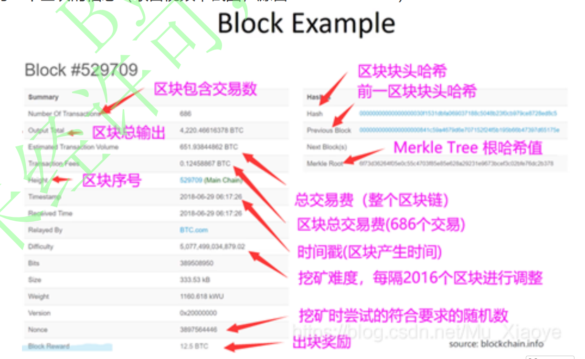
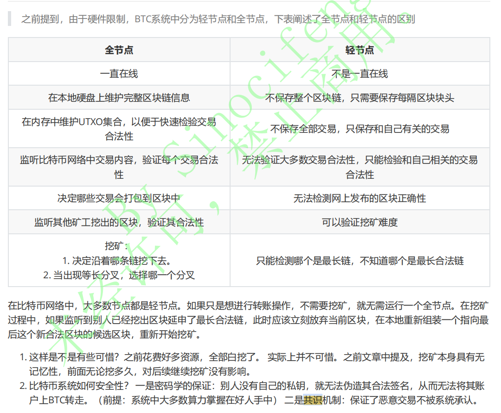
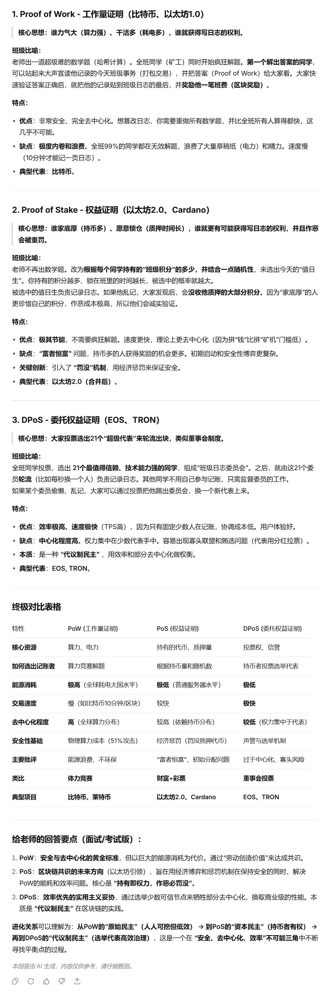
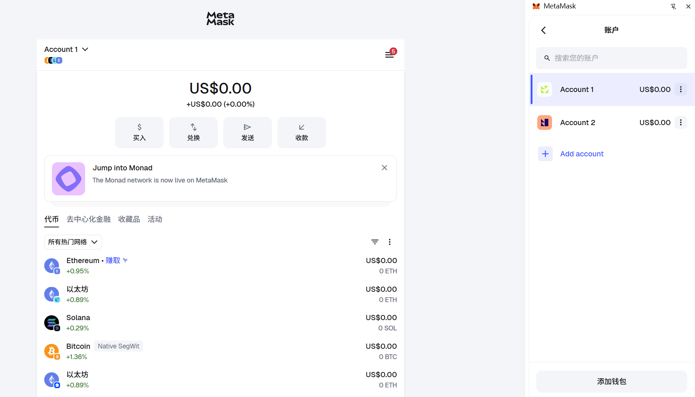

### 扫盲重点内容：

- 区块链技术概览（了解）
- 区块链共识算法（https://github.com/MetaNodeAcademy/WeeklyTask/blob/main/%E7%AC%AC%201%20%E5%91%A8%20%E6%8E%8C%E6%8F%A1%E5%8C%BA%E5%9D%97%E9%93%BE%E6%8A%80%E6%9C%AF%E5%8E%9F%E7%90%86/2.%20%E5%8A%A0%E5%AF%86%E6%8A%80%E6%9C%AF%E3%80%81%E5%85%B1%E8%AF%86%E6%9C%BA%E5%88%B6%E5%9F%BA%E7%A1%80/%E5%85%B1%E8%AF%86%E6%9C%BA%E5%88%B6/%E5%85%B1%E8%AF%86%E6%9C%BA%E5%88%B6%E5%9F%BA%E7%A1%80.md#1-pow-%E5%85%B1%E8%AF%86%E7%AE%97%E6%B3%95）（pow pos dpos）掌握
- 加密钱包和网络的使用（掌握）
- BTC ETH原理（有时间的话去了解）
- 北京大学肖臻老师《区块链技术与应用》公开课（有时间的话推荐看一下，对于理解区块链的结构有较大帮助）
- 搞清楚以下问题
  - 简述POW挖矿的过程，怎么处理分叉的情况
  - 为什么说区块链是不可篡改的（密码学、共识）
  - POW的难度调整机制
  - 什么是双花，什么情况下会产生
  - POW与POS的区别是什么，优缺点
  - DPOS的机制，优缺点
  - https://decert.me/quests/6dbd42f6-2677-4b8d-9d89-aca896d60a89  测试题

# 扫盲重点内容

## 区块链技术概览（了解）

所谓区块链，就是从原始的中心化交易系统---->去中心化系统

2008年11月中本聪发明比特币，开启了区块链的道路，比特币白皮书

去中心化的电子交易系统：比如A、B、C、D进行交易，相互之间进行支付

- A----->B 10个bitcoin，同时将这个账单告诉其余3人，大家都记账
- B----->C 5个bitcoin，，同时将这个账单告诉其余3人，大家都记账
- 。。。

这样一来，就一个账本，节点中的所有人将这个账本打包，打包成一个区块，这个区块的大小是1MB，可以存4000条交易记录。

这个块打包完成后，再接入到之前的交易块的后面，以此不断接入，形成一条链，我们就叫区块链

## 区块信息

完整区块包括块头和body，构成如下

 

区块块头信息如下

 

## 轻节点和全节点

 

## （pow pos dpos）掌握

定义、优缺点

 

**注意：DPOS有101个选举的超级节点**

## 加密钱包和网络的使用（掌握）

1、安装小狐狸钱包，并创建2个账号

  

2、连接到X Layer 水龙头测试网，尝试在2个账号间互转代币

 

## BTC ETH原理（有时间的话去了解）

## 搞清楚以下问题

北京大学肖臻老师《区块链技术与应用》公开课（有时间的话推荐看一下，对于理解区块链的结构有较大帮助）

1. **简述POW挖矿的过程，怎么处理分叉的情况**

   - 挖矿
     - 挖矿是通过专用“矿机”计算生产虚拟货币的过程，其本质是计算机通过解决复杂数学问题来获取加密货币奖励。‌
     - 更精细的理解就是，区块尝试各种nonce随机值，使得产生的区块哈希值小于等于目标阈值0。
     - 只要有一台矿机计算的hash值满足要求，那么这个区块就会拥有铸币权，会产生一定数量比特币的奖励
   - 如何处理分叉？
     - 所有矿工遵循最长链原则
     - 从各个矿工从分叉的位置分别往后挖，哪个分叉最先挖到下一个区块，会立即对所有节点进行广播，此时其他所有节点将会从最长的区块开始往后挖，之前分叉的短区块会被抛弃。

2. **为什么说区块链是不可篡改的（密码学、共识）**

   - 一是密码学的保证：别人没有自己的私钥，就无法伪造其合法签名，从而无法将其账户上BTC转走（前提：系统中大多数算力掌握在好人手中）。
   -  二是共识机制：保证了恶意交易不被系统承认。有几个重要特点：
     - **工作量证明（PoW）**：记账权取决于计算力投入，篡改历史需要超过全网51%的计算力，成本极高。
     - **最长链原则**：节点始终认可**累计工作量最大（最长/最难链）** 的链为主链，分歧时以此为准。
     - **去中心化信任**：不依赖任何中心机构，通过数学和博弈规则建立信任。

3. POW的难度调整机制

   - 比特币系统中，要求10分钟出一个块。随着算力的增强，如果不进行难度调整，那么出块的速度会极大提高。为此要设立难度调整机制。
   - 每2016个块，调整一次难度阈值。用出这2016块实际的时间/2016块的理论时间，对原始target做动态调整。
   - 但是动态调整不会超过原始target的上下四倍
   - 2016个块，10分钟一个块，总耗时就是2个星期

4. 什么是双花，什么情况下会产生，如何预防

   - 什么是双花
     - 双花是指同一数字资产被重复使用，即一笔钱同时转发给多个人。
   - 什么情况下产生
     - 恶意攻击：比如A想将自己的钱重复向外支付
     - 网络延迟：比如A向B支付，又向C支付，但是网络中有的人先接收到A对B的交易，有的人先接收到A对C的交易
   - 如何预防：
     - 针对恶意攻击，我们通过主链追溯币的来源，可以一直往上追溯到铸币的那个节点。
     - 针对网络延迟，迟早会有一个节点会先将A向B支付，或者A向C支付谁先支付的，追加到主链中，那么另一个就会被废弃。

5. POW（PoW）与POS（权益证明）的区别是什么，优缺点。见上述解析

6. DPOS的机制，优缺点

7. https://decert.me/quests/6dbd42f6-2677-4b8d-9d89-aca896d60a89  测试题

8. 测试题做完后提交到github，然后发群里

## 共识算法

区块链共识算法（https://github.com/MetaNodeAcademy/WeeklyTask/blob/main/%E7%AC%AC%201%20%E5%91%A8%20%E6%8E%8C%E6%8F%A1%E5%8C%BA%E5%9D%97%E9%93%BE%E6%8A%80%E6%9C%AF%E5%8E%9F%E7%90%86/2.%20%E5%8A%A0%E5%AF%86%E6%8A%80%E6%9C%AF%E3%80%81%E5%85%B1%E8%AF%86%E6%9C%BA%E5%88%B6%E5%9F%BA%E7%A1%80/%E5%85%B1%E8%AF%86%E6%9C%BA%E5%88%B6/%E5%85%B1%E8%AF%86%E6%9C%BA%E5%88%B6%E5%9F%BA%E7%A1%80.md#1-pow-%E5%85%B1%E8%AF%86%E7%AE%97%E6%B3%95）

## 共识机制解决了什么问题？

想象一个去中心化的班级，没有班长，但大家要共同维护一份**唯一、不可篡改的班级日志**。
**共识机制要解决的问题就是：谁来写今天的日志？凭什么选他？如果同时有几个人写，听谁的？**

这个就是共识机制要解决的问题
